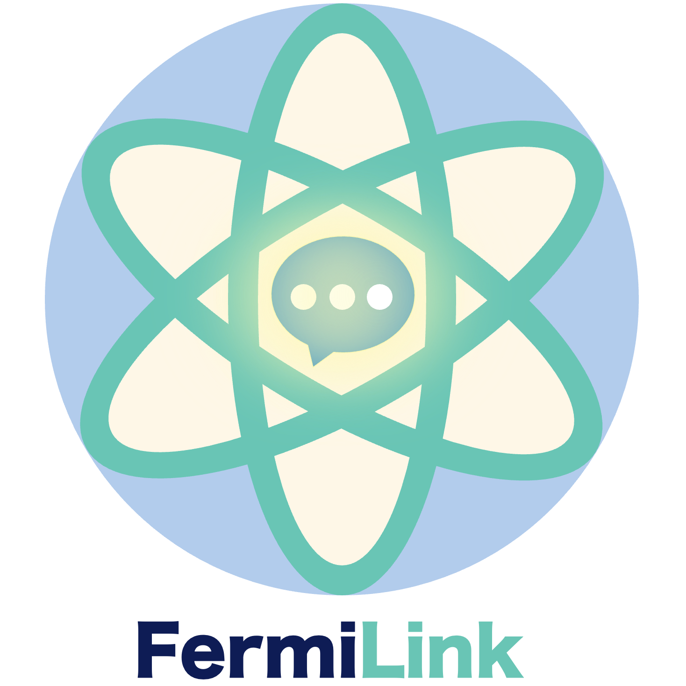

<p align="center">
  
</p>

<p align="center">
  <a href="https://project-optimization.fermilink.org"></a>
  <a href="https://fermilink.org/optimize.html"></a>
  <a href="https://github.com/TaoELi/FermiLink"></a>
  
</p>

<h3 align="center">Share a <code>fermilink optimize</code> run. Help grow the gallery.</h3>

<p align="center">
<b>Project Optimization</b> is an open gallery of
<code>fermilink optimize</code> runs on real scientific codebases.<br>
Every entry is a self-contained Sphinx bundle produced from a completed
<code>.fermilink-optimize</code> workspace,<br>
so collaborators can review and examine optimized codes end-to-end.
</p>

---

## What this repo is

This repository is the **contributor workflow** behind
[project-optimization.fermilink.org](https://project-optimization.fermilink.org).
It hosts:

- The Sphinx site that renders the public gallery.
- The `add_entry.py` helper that turns your local
  `.fermilink-optimize` workspace into a checked-in bundle.

If you just want to **browse runs**, head to the live gallery at [project-optimization.fermilink.org](https://project-optimization.fermilink.org). 

If you want to **contribute a run**, follow the five steps below.

> ⚠️ **Experimental feature.** `fermilink optimize` is still in beta.
> Always review and validate the generated code before using it in
> scientific or production work.

---

## Contribute a run in 5 steps

Total time: ~15 minutes of hands-on work (plus however long your
`fermilink optimize` job takes).

### 1. Install FermiLink locally

Clone and install the FermiLink core package from source so that the
`fermilink` CLI is available:

```bash
git clone https://github.com/TaoELi/FermiLink.git
cd FermiLink
pip install .
```


> **New to FermiLink?** See the  [installation guide](https://fermilink.org/installation.html) and the [optimize tutorial](https://fermilink.org/optimize.html) first.

### 2. Fork and clone this repo

Fork [`TaoELi/project-optimization`](https://github.com/TaoELi/project-optimization)
on GitHub (use the **Fork** button, top-right), then clone **your fork**
locally:

```bash
git clone https://github.com/<your-username>/project-optimization.git
cd project-optimization
```

Create a branch for your contribution:

```bash
git checkout -b add-<package>-<task>
# e.g.  git checkout -b add-lammps-neighbor
```

### 3. Run a `fermilink optimize` job

On **your own scientific codebase** (not inside this repo), run a
`fermilink optimize` job by following the full walkthrough at
[fermilink.org/optimize.html](https://fermilink.org/optimize.html).


When the run finishes, a `.fermilink-optimize/` directory will be
sitting at the repo root of your code, containing all runtime data of the optimization job. 

### 4. Add a new entry to the local gallery

From anywhere on your machine, run:

```bash
python path/to/project-optimization/scripts/add_entry.py \
       path/to/your-optimized-code/
```

You can point the script at either:

- The **project root** of your optimized code (the folder that contains
  `.fermilink-optimize/`), **or**
- The `.fermilink-optimize/` directory itself.

By default the script infers `<package>` and `<task>` from the current
branch name of your code repo (expected form:
`fermilink-optimize/<package>-<task>`). You can override either with
`--package` and `--task` when needed:

```bash
python scripts/add_entry.py /path/to/your/code \
       --package lammps --task neighbor
```

The script writes a new bundle to:

```
project-optimization/source/entries/<package>/<task>/
```

### 5. Preview locally, then open a pull request

Install the docs build dependencies and build the site:

```bash
cd path/to/project-optimization
pip install .[docs]
make doc          # build HTML into build/html/
make html         # open the built site in your browser
```

Open the landing page and confirm that:

- Your new run appears under **Recorded optimization runs**.
- The per-task page renders cleanly.

If everything looks good, commit and push the new bundle:

```bash
git add source/entries/<package>/<task>
git commit -m "Add <package>/<task> optimization run"
git push -u origin add-<package>-<task>
```

Finally, open a pull request from your fork against
`TaoELi/project-optimization:main` on GitHub. A maintainer will review
and merge, and then your run will  be live on the public gallery automatically.

---

## Quick reference

| Step | Command |
|---|---|
| Install FermiLink core | `pip install .` inside the [FermiLink](https://github.com/TaoELi/FermiLink) repo |
| Clone your fork | `git clone https://github.com/<you>/project-optimization.git` |
| Run an optimize job | `fermilink optimize goal.md` (in your own code repo) |
| Add a new entry | `python scripts/add_entry.py <path-to-your-code>` |
| Install docs deps | `pip install .[docs]` (inside this repo) |
| Build the site | `make doc html` |
| Clean build output | `make clean` |

---

## Repository layout

```
project-optimization/
├── Makefile                        # make doc / make html / make clean
├── pyproject.toml                  # docs build deps (Sphinx, Furo, myst)
├── scripts/
│   └── add_entry.py                # wraps optimize-report into this site
├── source/
│   ├── conf.py                     # Furo theme + auto-aggregation hook
│   ├── index.rst                   # landing page (hero + gallery)
│   ├── _templates/page.html        # custom hero / Contribute section
│   ├── _static/                    # CSS, logo marks, fonts
│   ├── packages/<pkg>.rst          # auto-generated summary (gitignored)
│   └── entries/<pkg>/<task>/       # checked-in bundles — this is where
│                                   #   add_entry.py writes
└── build/html/                     # local build output (gitignored)
```

---

## Advanced options for `add_entry.py`

`scripts/add_entry.py` is a thin wrapper around
`skills/optimize-report/assets/build_report.py` in the FermiLink core
repo. It supports the following flags:

| Flag | Purpose |
|---|---|
| `--package <slug>` | Override the inferred package name |
| `--task <slug>` | Override the inferred task name |
| `--title "<text>"` | Set a custom title for the entry page |
| `--metric-label "<text>"` | Rename the y-axis metric (e.g., `runtime (s)`) |
| `--direction {lower,higher}` | Direction of improvement (default: `lower`) |
| `--git-push` | Forward to the underlying skill, which runs a guarded `git push --set-upstream` on `fermilink-optimize*` branches. When the remote is GitHub, displayed commit hashes in the generated report also hyperlink back to GitHub. |

Run `python scripts/add_entry.py --help` for the full list.

---

## Related links

| Resource | Link |
|---|---|
| FermiLink core repo | [github.com/TaoELi/FermiLink](https://github.com/TaoELi/FermiLink) |
| Main FermiLink docs | [fermilink.org](https://fermilink.org) |
| Optimize tutorial | [fermilink.org/optimize.html](https://fermilink.org/optimize.html) |
| Live gallery | [project-optimization.fermilink.org](https://project-optimization.fermilink.org) |
| This repo on GitHub | [github.com/TaoELi/project-optimization](https://github.com/TaoELi/project-optimization) |

---

## License

Same as FermiLink core: [AGPL-3.0](https://github.com/TaoELi/FermiLink/blob/main/LICENSE).
