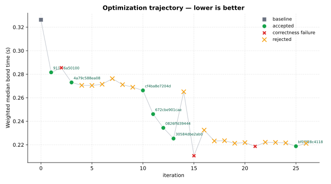
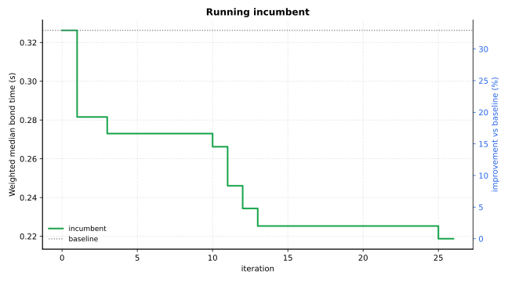

Optimization Report — lammps-bond
=================================

.. note::

   The optimized code summarized in this report was generated by the FermiLink AI agent. Review and validate the code changes yourself before using the modified code in scientific or production work. This optimization reporting feature is experimental and is not a final, mature solution.

Primary metric: ``Weighted median bond time (s)`` (lower is better).

Goal
----


Copied source goal for this optimization: :download:`goal.md <contract/goal.md>`

.. code-block:: markdown

   # Optimization Goal
   
   ## Package
   lammps
   
   ## Language
   cpp
   
   ## Target
   Optimize the bonded-force hot path of the TIP4P long-range water NVE workflow in LAMMPS, with primary focus on the intramolecular `bond_style class2` and `angle_style harmonic` kernels that run every timestep.
   
   In `src/verlet.cpp`, the TIP4P NVE loop invokes `force->bond->compute()` and `force->angle->compute()` every step after pair forces and before PPPM. For this input deck, the relevant hot paths are `src/CLASS2/bond_class2.cpp` and `src/MOLECULE/angle_harmonic.cpp`: `BondClass2::compute()` walks `neighbor->bondlist` and evaluates the class2 polynomial for every O-H bond, while `AngleHarmonic::compute()` walks `neighbor->anglelist` and performs the two-bond geometry plus `acos()`-based force evaluation for every H-O-H angle. Because the benchmark replicates 216 waters by `4x4x4`, these bonded kernels execute over tens of thousands of topology elements every step even though pair and kspace dominate the largest buckets.
   
   Primary optimization interest is reducing the bonded contribution to full-loop runtime for fixed-size water systems while preserving the same intramolecular model, timestep, and stable NVE behavior.
   
   This goal assumes benchmark generation will use the attached input artifacts by filename (`water_216_data.lmp`, `in.tip4p_nve`, and `in.tip4p_nve_long`) and resolve them from the staged goal input root.
   
   ## Editable Scope
   - src/CLASS2/bond_class2.cpp
   - src/CLASS2/bond_class2.h
   - src/MOLECULE/angle_harmonic.cpp
   - src/MOLECULE/angle_harmonic.h
   
   ## Performance Metric
   Minimize weighted median `bond_seconds` across all benchmark cases.
   
   Benchmark should also record `loop_seconds`, `bond_seconds`, `pair_seconds`, `kspace_seconds`, `neigh_seconds`, `comm_seconds`, and normalized throughput (for example, steps/second or ns/day). Secondary objective should be lower `loop_seconds` without shifting work into another timer bucket or winning only through decomposition artifacts.
   
   ## Correctness Constraints
   - Preserve NVE energy behavior: total energy drift per atom per step over the longer runs must stay within benchmark tolerance versus incumbent baseline.
   - Preserve sampled thermo observables at matched output steps: `etotal`, `pe`, `ke`, `temp`, `press`, and `density` must stay within benchmark tolerance.
   - Preserve sampled force consistency for representative frames: RMS and max absolute force-component deltas must stay within benchmark tolerance.
   - Preserve bonded-model semantics exactly: keep `bond_style class2`, `angle_style harmonic`, bond/angle coefficients, topology ownership, and Newton bonded-force accumulation behavior unchanged.
   - Preserve trajectory invariants for identical initial state and deterministic seed: same atom count, stable completion, no lost atoms, and no NaN/Inf.
   - Do not change physical model semantics or runtime controls to gain speed: keep `pair_style lj/cut/tip4p/long`, `kspace_style pppm/tip4p 0.0001`, `neighbor 2.0 bin`, `timestep 0.5`, units, and TIP4P geometry assumptions unchanged.
   - All benchmark cases must complete successfully with deterministic runner settings.
   
   ## Representative Workloads
   - train-16r-short: `in.tip4p_nve` + `water_216_data.lmp` on 16 MPI ranks, where communication is lighter and bonded compute is easier to resolve against the full loop.
   - train-32r-short: `in.tip4p_nve` + `water_216_data.lmp` on 32 MPI ranks to keep the bonded optimization useful across a second domain decomposition.
   - train-16r-long: `in.tip4p_nve_long` + `water_216_data.lmp` on 16 MPI ranks for a longer-horizon NVE drift and timer-stability case.
   - test-32r-long: `in.tip4p_nve_long` + `water_216_data.lmp` on 32 MPI ranks as a held-out moderate-decomposition validation case.
   - test-64r-short: `in.tip4p_nve` + `water_216_data.lmp` on 64 MPI ranks as a held-out scaling-sensitive case; this case should not define the primary optimization direction.
   
   ## Build
   ```bash
   mkdir -p build
   cd build
   cmake -C ../cmake/presets/most.cmake -C ../cmake/presets/nolib.cmake -D PKG_GPU=off ../cmake
   cmake --build . -j4
   ```
   
   ## Notes
   - Treat the attached LAMMPS input file(s) as the source of truth for runtime settings and any include-chain files.
   - This campaign is intended to find algorithm-level improvements inside the named bonded kernels, not generic pair, PPPM, neighbor, or communication tuning.
   - Keep benchmark execution deterministic: fixed thread settings, fixed random seeds (if any), and explicit launch command.
   - Run LAMMPS with full timer output so the benchmark runner can parse `Bond`, `Pair`, `Kspace`, `Neigh`, `Comm`, and total loop timings from the standard timing table.
   - In generated benchmark YAML, include `runtime.pre_commands` derived from the build section so authoritative runs rebuild the edited LAMMPS binary before benchmarking.
   - In generated benchmark runtime command, invoke LAMMPS via MPI launcher with the case-specific rank count (16, 32, or 64), not one fixed rank count for every case.
   - Set `OMP_NUM_THREADS=1` unless a case explicitly requires hybrid MPI+OpenMP, and keep this setting identical across baseline/candidate runs.
   - In generated benchmark YAML, include a split block so worker sees the train cases only:
     ```yaml
     split:
       train_case_ids:
         - train-16r-short
         - train-32r-short
         - train-16r-long
     ```

Summary
-------


- baseline (`e7c0ed95a333 <summary-baseline-e7c0ed95a333_>`_): ``0.32627``
- best accepted (`bf07f28c4118 <summary-best-bf07f28c4118_>`_): ``0.21875`` (+32.95% vs baseline)
- published GitHub branch: `fermilink-optimize/lammps-bond <https://github.com/skilled-scipkg/lammps/tree/fermilink-optimize%2Flammps-bond>`_
- iterations: 27 total | 7 accepted | 16 rejected | 3 correctness failure

Optimization Trajectory
-----------------------






All iterations
--------------


+------+-------------------------------------------------+---------------------+---------+-------------------------------------------------------------------------------------------------------------+
| iter | commit                                          | status              | metric  | summary                                                                                                     |
+======+=================================================+=====================+=========+=============================================================================================================+
| 0    | `e7c0ed95a333 <iter-0000-table-e7c0ed95a333_>`_ | baseline            | 0.32627 | baseline                                                                                                    |
+------+-------------------------------------------------+---------------------+---------+-------------------------------------------------------------------------------------------------------------+
| 1    | `911f06a50100 <iter-0001-table-911f06a50100_>`_ | accepted            | 0.28156 | Hoist \`evflag\`/\`eflag\`/\`newton_bond\` branches out of the serial \`bond_class2\` and \`angle_harmonic… |
+------+-------------------------------------------------+---------------------+---------+-------------------------------------------------------------------------------------------------------------+
| 2    | 25f839bdfc42                                    | correctness_failure | 0.28546 | Reuse per-type coefficients and reciprocals, evaluate the class2 polynomial in a lower-overhead f…          |
+------+-------------------------------------------------+---------------------+---------+-------------------------------------------------------------------------------------------------------------+
| 3    | `4a79c588ea08 <iter-0003-table-4a79c588ea08_>`_ | accepted            | 0.27301 | Add a \`bond_class2\` single-bond-type fast path that dispatches to a dedicated \`eval_one_type\` hel…      |
+------+-------------------------------------------------+---------------------+---------+-------------------------------------------------------------------------------------------------------------+
| 4    | e5c1ddf090fa                                    | rejected            | 0.27052 | Add an \`angle_harmonic\` single-angle-type fast path that dispatches to \`eval_one_type\` and hoists…      |
+------+-------------------------------------------------+---------------------+---------+-------------------------------------------------------------------------------------------------------------+
| 5    | 224da0125669                                    | rejected            | 0.27041 | Cache per-bond force components in bond_class2 and restore the single-angle-type fast path in ang…          |
+------+-------------------------------------------------+---------------------+---------+-------------------------------------------------------------------------------------------------------------+
| 6    | e639b3949f97                                    | rejected            | 0.27144 | Accumulate consecutive same-\`i1\` bonds in the single-type \`bond_class2\` fast path to reuse the le…      |
+------+-------------------------------------------------+---------------------+---------+-------------------------------------------------------------------------------------------------------------+
| 7    | 47d88a349494                                    | rejected            | 0.27624 | Restore the \`angle_harmonic\` single-angle-type fast path and add an explicit same-\`i1\` two-bond b…      |
+------+-------------------------------------------------+---------------------+---------+-------------------------------------------------------------------------------------------------------------+
| 8    | e3c2ae9ee96a                                    | rejected            | 0.27111 | Restore \`angle_harmonic\` single-angle-type dispatch and tighten one-type bonded hot paths by only…        |
+------+-------------------------------------------------+---------------------+---------+-------------------------------------------------------------------------------------------------------------+
| 9    | 6fbda0abc94b                                    | rejected            | 0.26892 | Add a dedicated two-way unrolled \`bond_class2\` one-type hot path for the dominant no-\`evflag\`, Ne…      |
+------+-------------------------------------------------+---------------------+---------+-------------------------------------------------------------------------------------------------------------+
| 10   | `cf4ba8e7204d <iter-0010-table-cf4ba8e7204d_>`_ | accepted            | 0.26621 | Combine the correctness-safe \`bond_class2\` one-type two-way unrolled hot kernel with the correctn…        |
+------+-------------------------------------------------+---------------------+---------+-------------------------------------------------------------------------------------------------------------+
| 11   | `672cbe901cae <iter-0011-table-672cbe901cae_>`_ | accepted            | 0.24606 | Add a dedicated \`angle_harmonic\` one-type no-\`evflag\`, Newton-on hot path with scalar force tempo…      |
+------+-------------------------------------------------+---------------------+---------+-------------------------------------------------------------------------------------------------------------+
| 12   | `0826ffd39444 <iter-0012-table-0826ffd39444_>`_ | accepted            | 0.23436 | Cache one-type bond_class2 bond geometry and reuse paired bond data in angle_harmonic's dominant …          |
+------+-------------------------------------------------+---------------------+---------+-------------------------------------------------------------------------------------------------------------+
| 13   | `30584dbe2ab0 <iter-0013-table-30584dbe2ab0_>`_ | accepted            | 0.22529 | Replace the one-type bond-to-angle reuse with an angle-oriented cache built in \`bond_class2\`, the…        |
+------+-------------------------------------------------+---------------------+---------+-------------------------------------------------------------------------------------------------------------+
| 14   | 0890ed81e853                                    | rejected            | 0.26506 | Replace the one-type bond-to-angle geometry cache with a prepared per-angle force cache built in …          |
+------+-------------------------------------------------+---------------------+---------+-------------------------------------------------------------------------------------------------------------+
| 15   | fdcd68522a83                                    | correctness_failure | 0.21063 | Compact the angle hot cache to bond deltas plus inverse bond lengths and consume them in the cach…          |
+------+-------------------------------------------------+---------------------+---------+-------------------------------------------------------------------------------------------------------------+
| 16   | 1f058192fe33                                    | rejected            | 0.23245 | Compact the angle hot cache to bond deltas plus exact bond lengths, recomputing cached-path rsq v…          |
+------+-------------------------------------------------+---------------------+---------+-------------------------------------------------------------------------------------------------------------+
| 17   | 738ffb9e3a30                                    | rejected            | 0.22321 | Precompute the one-type bond/angle pairing layout once per topology build and reuse it in bond_cl…          |
+------+-------------------------------------------------+---------------------+---------+-------------------------------------------------------------------------------------------------------------+
| 18   | bed99cfa6486                                    | rejected            | 0.22343 | Prepare and reuse a prevalidated one-type bond-angle orientation layout in \`bond_class2\` hot cach…        |
+------+-------------------------------------------------+---------------------+---------+-------------------------------------------------------------------------------------------------------------+
| 19   | acd350270fd3                                    | rejected            | 0.22126 | Compact the cached angle hot entry to store the exact bond-length product \`r12 = r1*r2\` instead o…        |
+------+-------------------------------------------------+---------------------+---------+-------------------------------------------------------------------------------------------------------------+
| 20   | c0a62a11cfaf                                    | rejected            | 0.22182 | Combine prevalidated bond-angle orientation layout reuse in \`bond_class2\` with exact \`r12\` hot-ca…      |
+------+-------------------------------------------------+---------------------+---------+-------------------------------------------------------------------------------------------------------------+
| 21   | e4103f7dab04                                    | correctness_failure | 0.21864 | Store exact \`r12 = r1*r2\` in the hot angle cache and reuse a shared local \`inv_r12\` in the cached…      |
+------+-------------------------------------------------+---------------------+---------+-------------------------------------------------------------------------------------------------------------+
| 22   | efcb4c8f585c                                    | rejected            | 0.22213 | Compact the one-type hot angle cache to exact \`r12 = r1*r2\` and add prepared hot-angle index/layo…        |
+------+-------------------------------------------------+---------------------+---------+-------------------------------------------------------------------------------------------------------------+
| 23   | 567a79cfb769                                    | rejected            | 0.22195 | Widen the cached \`angle_harmonic\` hot consumer to four-way exact unrolling while preserving the i…        |
+------+-------------------------------------------------+---------------------+---------+-------------------------------------------------------------------------------------------------------------+
| 24   | 2c69753dfc48                                    | rejected            | 0.22158 | Combine exact \`r12\` hot-angle cache compaction in \`bond_class2\` with a four-way cached \`angle_har…     |
+------+-------------------------------------------------+---------------------+---------+-------------------------------------------------------------------------------------------------------------+
| 25   | `bf07f28c4118 <iter-0025-table-bf07f28c4118_>`_ | accepted            | 0.21875 | Compact the hot angle cache to exact r12 payloads and widen the one-type cached bond_class2 produ…          |
+------+-------------------------------------------------+---------------------+---------+-------------------------------------------------------------------------------------------------------------+
| 26   | a0800c8480fc                                    | rejected            | 0.22115 | Restore prepared hot-angle layout/index reuse in bond_class2 and a four-way cached angle_harmonic…          |
+------+-------------------------------------------------+---------------------+---------+-------------------------------------------------------------------------------------------------------------+

Accepted Commits
----------------


Accepted candidate detail pages and current manual-review status:

+-----------------------------------------------------+----------------------------------------+
| accepted commit                                     | Human verification                     |
+=====================================================+========================================+
| :doc:`911f06a50100 <iterations/iter_0001_accepted>` | not verified                           |
+-----------------------------------------------------+----------------------------------------+
| :doc:`4a79c588ea08 <iterations/iter_0003_accepted>` | not verified                           |
+-----------------------------------------------------+----------------------------------------+
| :doc:`cf4ba8e7204d <iterations/iter_0010_accepted>` | not verified                           |
+-----------------------------------------------------+----------------------------------------+
| :doc:`672cbe901cae <iterations/iter_0011_accepted>` | not verified                           |
+-----------------------------------------------------+----------------------------------------+
| :doc:`0826ffd39444 <iterations/iter_0012_accepted>` | not verified                           |
+-----------------------------------------------------+----------------------------------------+
| :doc:`30584dbe2ab0 <iterations/iter_0013_accepted>` | not verified                           |
+-----------------------------------------------------+----------------------------------------+
| :doc:`bf07f28c4118 <iterations/iter_0025_accepted>` | not verified                           |
+-----------------------------------------------------+----------------------------------------+

.. toctree::
   :maxdepth: 1
   :hidden:

   iterations/iter_0001_accepted
   iterations/iter_0003_accepted
   iterations/iter_0010_accepted
   iterations/iter_0011_accepted
   iterations/iter_0012_accepted
   iterations/iter_0013_accepted
   iterations/iter_0025_accepted

Benchmark Contracts
-------------------


Necessary files to reproduce the FermiLink optimization results:

- :download:`benchmark.yaml <contract/benchmark.yaml>`
- :download:`benchmark_runner.py <contract/benchmark_runner.py>`
- :download:`goal.md <contract/goal.md>`

Input files for Benchmarks
--------------------------


Copied auxiliary benchmark inputs from ``.fermilink-optimize/inputs/all/``:

- :download:`in.tip4p_nve <inputs/all/in.tip4p_nve>`
- :download:`in.tip4p_nve_long <inputs/all/in.tip4p_nve_long>`
- :download:`water_216_data.lmp <inputs/all/water_216_data.lmp>`

Runtime Data
------------


FermiLink runtime data for accepted/rejected commits.

- :download:`results.tsv <data/results.tsv>`
- :download:`summary.json <data/summary.json>`

Rerun Guide
-----------


Agent provider ``codex``; model ``gpt-5.4-xhigh``

Use the bundled contract files from this report to recreate the optimization against a fresh upstream checkout.

- default upstream clone: ``git@github.com:skilled-scipkg/lammps.git``
- confirm the upstream default branch before creating the worktree: `develop on GitHub <https://github.com/skilled-scipkg/lammps/tree/develop>`_
- detected package language: ``cpp``; use ``fermilink-optimize-cpp`` for goal-mode reruns
- if :download:`goal_inputs.json <contract/goal_inputs.json>` is present, restage the listed auxiliary workload files before rerunning
- copied benchmark input files are bundled under ``inputs/all/`` and should be restored into ``.fermilink-optimize/inputs/all/`` for deterministic reruns

.. code-block:: bash

   git clone git@github.com:skilled-scipkg/lammps.git
   cd lammps
   git worktree add -b fermilink-optimize/lammps-<modified-feature> ../lammps-<modified-feature> develop

Path 1: Rerun from goal.md
~~~~~~~~~~~~~~~~~~~~~~~~~~

Rerun from the bundled :download:`goal.md <contract/goal.md>`.

.. note::

   Tune the copied ``## Build`` section in :download:`goal.md <contract/goal.md>` before rerunning. Update environment activation, module loads, compiler paths, install prefixes, and other machine-specific setup so FermiLink builds the package correctly.

   .. code-block:: bash

      mkdir -p build
      cd build
      cmake -C ../cmake/presets/most.cmake -C ../cmake/presets/nolib.cmake -D PKG_GPU=off ../cmake
      cmake --build . -j4

.. note::

   The copied ``## Representative Workloads`` section references input files that are also bundled under ``Input files for Benchmarks``. Copy these files into the same directory as the ``goal.md`` file used for this rerun before launching FermiLink, so goal mode can capture and stage them:

   - :download:`in.tip4p_nve <inputs/all/in.tip4p_nve>`
   - :download:`in.tip4p_nve_long <inputs/all/in.tip4p_nve_long>`
   - :download:`water_216_data.lmp <inputs/all/water_216_data.lmp>`

Run this from the cloned main repo so the launcher can create or reuse the sibling worktree:

.. code-block:: bash

   fermilink-optimize-cpp \
     --project-root "$PWD" \
     --goal /path/to/report/contract/goal.md \
     --branch fermilink-optimize/lammps-<modified-feature> \
     --worktree-root .. \
     --worktree-name lammps-<modified-feature>

Path 2: More deterministic rerun from benchmark.yaml
~~~~~~~~~~~~~~~~~~~~~~~~~~~~~~~~~~~~~~~~~~~~~~~~~~~~

Rerun from the copied :download:`benchmark.yaml <contract/benchmark.yaml>` and :download:`benchmark_runner.py <contract/benchmark_runner.py>`. These files are generated from ``goal.md`` by FermiLink, serving as a deterministic benchmark contract that the agent needs to follow during optimization iterations. FermiLink does not directly rely on ``goal.md`` for optimization iterations.

This avoids regenerating the benchmark contract from ``goal.md`` before the campaign starts:

.. note::

   Inspect :download:`benchmark.yaml <contract/benchmark.yaml>` before rerunning. Update ``runtime.pre_commands`` for machine-specific build/setup steps, and verify that ``runtime.command`` paths point at files that exist in the new worktree.

.. code-block:: bash

   cd ../lammps-<modified-feature>
   mkdir -p .fermilink-optimize/autogen .fermilink-optimize/inputs/all
   cp /path/to/report/contract/benchmark.yaml .fermilink-optimize/autogen/benchmark.yaml
   cp /path/to/report/contract/benchmark_runner.py .fermilink-optimize/autogen/benchmark_runner.py
   cp -R /path/to/report/inputs/all/. .fermilink-optimize/inputs/all/
   printf '%s\n' '.fermilink-optimize/' >> .git/info/exclude
   fermilink optimize lammps "$PWD" \
     --benchmark "$PWD/.fermilink-optimize/autogen/benchmark.yaml" \
     --skills-source existing

Benchmark Examples
------------------


Worker iterations run the ``train-*`` benchmark cases below while searching for candidate changes:

.. code-block:: yaml

   cases:
     - id: train-16r-short
       weight: 1.0
       input_script: in.tip4p_nve
       data_file: water_216_data.lmp
       mpi_ranks: 16
       omp_num_threads: 1
       expected_atoms: 41472
       expected_bonds: 27648
       expected_angles: 13824
       run_steps: 1200
       thermo_every: 100
       timer_mode: full
       timestep: 0.5
       pair_style: lj/cut/tip4p/long 1 2 1 1 0.278072379 17.007
       bond_style: class2
       angle_style: harmonic
       kspace_style: pppm/tip4p 0.0001
       neighbor: 2.0 bin
       replicate:
         - 4
         - 4
         - 4
     - id: train-32r-short
       weight: 1.0
       input_script: in.tip4p_nve
       data_file: water_216_data.lmp
       mpi_ranks: 32
       omp_num_threads: 1
       expected_atoms: 41472
       expected_bonds: 27648
       expected_angles: 13824
       run_steps: 1200
       thermo_every: 100
       timer_mode: full
       timestep: 0.5
       pair_style: lj/cut/tip4p/long 1 2 1 1 0.278072379 17.007
       bond_style: class2
       angle_style: harmonic
       kspace_style: pppm/tip4p 0.0001
       neighbor: 2.0 bin
       replicate:
         - 4
         - 4
         - 4
     - id: train-16r-long
       weight: 1.0
       input_script: in.tip4p_nve_long
       data_file: water_216_data.lmp
       mpi_ranks: 16
       omp_num_threads: 1
       expected_atoms: 41472
       expected_bonds: 27648
       expected_angles: 13824
       run_steps: 10000
       thermo_every: 100
       timer_mode: full
       timestep: 0.5
       pair_style: lj/cut/tip4p/long 1 2 1 1 0.278072379 17.007
       bond_style: class2
       angle_style: harmonic
       kspace_style: pppm/tip4p 0.0001
       neighbor: 2.0 bin
       replicate:
         - 4
         - 4
         - 4

Controller reviews run the ``test-*`` benchmark cases below to validate accepted candidates:

.. code-block:: yaml

   cases:
     - id: test-32r-long
       weight: 0.5
       input_script: in.tip4p_nve_long
       data_file: water_216_data.lmp
       mpi_ranks: 32
       omp_num_threads: 1
       expected_atoms: 41472
       expected_bonds: 27648
       expected_angles: 13824
       run_steps: 10000
       thermo_every: 100
       timer_mode: full
       timestep: 0.5
       pair_style: lj/cut/tip4p/long 1 2 1 1 0.278072379 17.007
       bond_style: class2
       angle_style: harmonic
       kspace_style: pppm/tip4p 0.0001
       neighbor: 2.0 bin
       replicate:
         - 4
         - 4
         - 4
     - id: test-64r-short
       weight: 0.25
       input_script: in.tip4p_nve
       data_file: water_216_data.lmp
       mpi_ranks: 64
       omp_num_threads: 1
       expected_atoms: 41472
       expected_bonds: 27648
       expected_angles: 13824
       run_steps: 1200
       thermo_every: 100
       timer_mode: full
       timestep: 0.5
       pair_style: lj/cut/tip4p/long 1 2 1 1 0.278072379 17.007
       bond_style: class2
       angle_style: harmonic
       kspace_style: pppm/tip4p 0.0001
       neighbor: 2.0 bin
       replicate:
         - 4
         - 4
         - 4


.. _summary-baseline-e7c0ed95a333: https://github.com/skilled-scipkg/lammps/commit/e7c0ed95a333
.. _summary-best-bf07f28c4118: https://github.com/skilled-scipkg/lammps/commit/bf07f28c4118
.. _iter-0000-table-e7c0ed95a333: https://github.com/skilled-scipkg/lammps/commit/e7c0ed95a333
.. _iter-0001-table-911f06a50100: https://github.com/skilled-scipkg/lammps/commit/911f06a50100
.. _iter-0002-table-25f839bdfc42: https://github.com/skilled-scipkg/lammps/commit/25f839bdfc42
.. _iter-0003-table-4a79c588ea08: https://github.com/skilled-scipkg/lammps/commit/4a79c588ea08
.. _iter-0004-table-e5c1ddf090fa: https://github.com/skilled-scipkg/lammps/commit/e5c1ddf090fa
.. _iter-0005-table-224da0125669: https://github.com/skilled-scipkg/lammps/commit/224da0125669
.. _iter-0006-table-e639b3949f97: https://github.com/skilled-scipkg/lammps/commit/e639b3949f97
.. _iter-0007-table-47d88a349494: https://github.com/skilled-scipkg/lammps/commit/47d88a349494
.. _iter-0008-table-e3c2ae9ee96a: https://github.com/skilled-scipkg/lammps/commit/e3c2ae9ee96a
.. _iter-0009-table-6fbda0abc94b: https://github.com/skilled-scipkg/lammps/commit/6fbda0abc94b
.. _iter-0010-table-cf4ba8e7204d: https://github.com/skilled-scipkg/lammps/commit/cf4ba8e7204d
.. _iter-0011-table-672cbe901cae: https://github.com/skilled-scipkg/lammps/commit/672cbe901cae
.. _iter-0012-table-0826ffd39444: https://github.com/skilled-scipkg/lammps/commit/0826ffd39444
.. _iter-0013-table-30584dbe2ab0: https://github.com/skilled-scipkg/lammps/commit/30584dbe2ab0
.. _iter-0014-table-0890ed81e853: https://github.com/skilled-scipkg/lammps/commit/0890ed81e853
.. _iter-0015-table-fdcd68522a83: https://github.com/skilled-scipkg/lammps/commit/fdcd68522a83
.. _iter-0016-table-1f058192fe33: https://github.com/skilled-scipkg/lammps/commit/1f058192fe33
.. _iter-0017-table-738ffb9e3a30: https://github.com/skilled-scipkg/lammps/commit/738ffb9e3a30
.. _iter-0018-table-bed99cfa6486: https://github.com/skilled-scipkg/lammps/commit/bed99cfa6486
.. _iter-0019-table-acd350270fd3: https://github.com/skilled-scipkg/lammps/commit/acd350270fd3
.. _iter-0020-table-c0a62a11cfaf: https://github.com/skilled-scipkg/lammps/commit/c0a62a11cfaf
.. _iter-0021-table-e4103f7dab04: https://github.com/skilled-scipkg/lammps/commit/e4103f7dab04
.. _iter-0022-table-efcb4c8f585c: https://github.com/skilled-scipkg/lammps/commit/efcb4c8f585c
.. _iter-0023-table-567a79cfb769: https://github.com/skilled-scipkg/lammps/commit/567a79cfb769
.. _iter-0024-table-2c69753dfc48: https://github.com/skilled-scipkg/lammps/commit/2c69753dfc48
.. _iter-0025-table-bf07f28c4118: https://github.com/skilled-scipkg/lammps/commit/bf07f28c4118
.. _iter-0026-table-a0800c8480fc: https://github.com/skilled-scipkg/lammps/commit/a0800c8480fc
