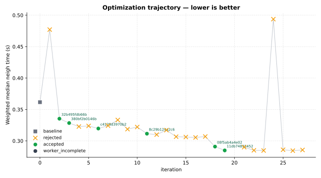
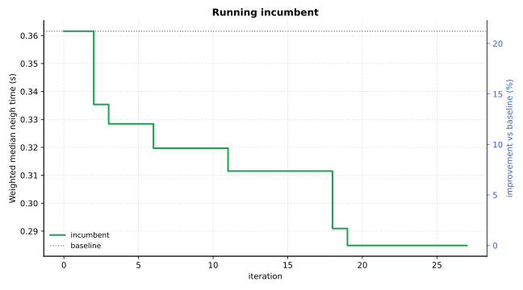

Optimization Report — lammps-neighbor
=====================================


Primary metric: ``Weighted median neigh time (s)`` (lower is better).

Goal
----


Copied source goal for this optimization: :download:`goal.md <contract/goal.md>`

.. code-block:: markdown

   # Optimization Goal
   
   ## Package
   lammps
   
   ## Language
   cpp
   
   ## Target
   Optimize the neighbor-list construction hot path of the TIP4P long-range water NVE workflow in LAMMPS, with primary focus on rebuild-time binning and pair-list generation for the `neighbor 2.0 bin` configuration used by the benchmark inputs.
   
   In `src/verlet.cpp`, the TIP4P NVE loop calls `neighbor->decide()` every step and `neighbor->build(1)` whenever reneighboring is required. For this input deck, the relevant hot paths are `src/neighbor.cpp` and `src/npair_bin.cpp`: `Neighbor::build()` stores the displacement reference state, bins all local and ghost atoms, builds the perpetual pair lists, and rebuilds topology lists, while `NPairBin::build()` loops over owned atoms and bin stencils, evaluates cutoffs and exclusions, and emits the neighbor lists consumed by the pair style.
   
   Primary optimization interest is reducing neighbor rebuild cost for the fixed-size water systems while preserving the same list completeness, rebuild safety, special-neighbor handling, and stable NVE behavior.
   
   This goal assumes benchmark generation will use the attached input artifacts by filename (`water_216_data.lmp`, `in.tip4p_nve`, and `in.tip4p_nve_long`) and resolve them from the staged goal input root.
   
   ## Editable Scope
   - src/neighbor.cpp
   - src/neighbor.h
   - src/npair_bin.cpp
   - src/npair_bin.h
   
   ## Performance Metric
   Minimize weighted median `neigh_seconds` across all benchmark cases.
   
   Benchmark should also record `loop_seconds`, `neigh_seconds`, `pair_seconds`, `kspace_seconds`, `comm_seconds`, `bond_seconds`, and normalized throughput (for example, steps/second or ns/day). Secondary objective should be lower `loop_seconds` without winning by skipping required rebuilds or weakening list safety.
   
   ## Correctness Constraints
   - Preserve NVE energy behavior: total energy drift per atom per step over the longer runs must stay within benchmark tolerance versus incumbent baseline.
   - Preserve sampled thermo observables at matched output steps: `etotal`, `pe`, `ke`, `temp`, `press`, and `density` must stay within benchmark tolerance.
   - Preserve sampled force consistency for representative frames: RMS and max absolute force-component deltas must stay within benchmark tolerance.
   - Preserve neighbor semantics exactly: same pair-list completeness, same special-neighbor encoding and exclusion behavior, same topology-list correctness for bonds and angles, and no dangerous builds or out-of-range atoms introduced by the optimization.
   - Do not change physical model semantics or runtime controls to gain speed: keep `pair_style lj/cut/tip4p/long`, `kspace_style pppm/tip4p 0.0001`, `neighbor 2.0 bin`, default rebuild-safety behavior, `timestep 0.5`, units, and TIP4P geometry assumptions unchanged.
   - Do not weaken distance checks, ghost coverage, or rebuild cadence safety to gain speed.
   - All benchmark cases must complete successfully with deterministic runner settings.
   
   ## Representative Workloads
   - train-16r-long: `in.tip4p_nve_long` + `water_216_data.lmp` on 16 MPI ranks, giving a longer run with repeated neighbor rebuild opportunities and lower communication noise.
   - train-32r-long: `in.tip4p_nve_long` + `water_216_data.lmp` on 32 MPI ranks to keep the optimization useful across a second domain decomposition.
   - train-32r-short: `in.tip4p_nve` + `water_216_data.lmp` on 32 MPI ranks as a shorter-turnaround rebuild case.
   - test-16r-short: `in.tip4p_nve` + `water_216_data.lmp` on 16 MPI ranks as a held-out lower-rank case.
   - test-64r-short: `in.tip4p_nve` + `water_216_data.lmp` on 64 MPI ranks as a held-out scaling-sensitive case where neighbor and communication interact more strongly.
   
   ## Build
   ```bash
   mkdir -p build
   cd build
   cmake -C ../cmake/presets/most.cmake -C ../cmake/presets/nolib.cmake -D PKG_GPU=off ../cmake
   cmake --build . -j4
   ```
   
   ## Notes
   - Treat the attached LAMMPS input file(s) as the source of truth for runtime settings and any include-chain files.
   - This campaign is intended to find algorithm-level improvements inside `src/neighbor.*` and `src/npair_bin.*`, not generic pair, PPPM, communication, or bonded-kernel tuning.
   - Keep benchmark execution deterministic: fixed thread settings, fixed random seeds (if any), and explicit launch command.
   - Run LAMMPS with full timer output so the benchmark runner can parse `Neigh`, `Pair`, `Kspace`, `Comm`, `Bond`, and total loop timings from the standard timing table.
   - In generated benchmark YAML, include `runtime.pre_commands` derived from the build section so authoritative runs rebuild the edited LAMMPS binary before benchmarking.
   - In generated benchmark runtime command, invoke LAMMPS via MPI launcher with the case-specific rank count (16, 32, or 64), not one fixed rank count for every case.
   - Set `OMP_NUM_THREADS=1` unless a case explicitly requires hybrid MPI+OpenMP, and keep this setting identical across baseline/candidate runs.
   - In generated benchmark YAML, include a split block so worker sees the train cases only:
     ```yaml
     split:
       train_case_ids:
         - train-16r-long
         - train-32r-long
         - train-32r-short
     ```

Summary
-------


- baseline (`e7c0ed95a333 <summary-baseline-e7c0ed95a333_>`_): ``0.36158``
- best accepted (`11db74893452 <summary-best-11db74893452_>`_): ``0.28487`` (+21.22% vs baseline)
- published GitHub branch: `fermilink-optimize/lammps-neighbor <https://github.com/skilled-scipkg/lammps/tree/fermilink-optimize%2Flammps-neighbor>`_
- iterations: 28 total | 6 accepted | 20 rejected | 0 correctness failure

Optimization Trajectory
-----------------------






All iterations
--------------


+------+-------------------------------------------------+-------------------+---------+--------------------------------------------------------------------------------------------------------+
| iter | commit                                          | status            | metric  | summary                                                                                                |
+======+=================================================+===================+=========+========================================================================================================+
| 0    | `e7c0ed95a333 <iter-0000-table-e7c0ed95a333_>`_ | baseline          | 0.36158 | baseline                                                                                               |
+------+-------------------------------------------------+-------------------+---------+--------------------------------------------------------------------------------------------------------+
| 1    | 2d1eda35b944                                    | rejected          | 0.47712 | Split the orthogonal half-bin/newton self-bin traversal in \`npair_bin.cpp\` and cache per-atom cut…   |
+------+-------------------------------------------------+-------------------+---------+--------------------------------------------------------------------------------------------------------+
| 2    | `32b495fdb66b <iter-0002-table-32b495fdb66b_>`_ | accepted          | 0.33535 | Specialize the orthogonal half/bin/newton neighbor build in \`src/npair_bin.cpp\` to remove generic…   |
+------+-------------------------------------------------+-------------------+---------+--------------------------------------------------------------------------------------------------------+
| 3    | `380bf2b0146b <iter-0003-table-380bf2b0146b_>`_ | accepted          | 0.32842 | Add a benchmark-specific fast path in \`NPairBin<1,1,0,0,0>::build()\` for standard molecular syste…   |
+------+-------------------------------------------------+-------------------+---------+--------------------------------------------------------------------------------------------------------+
| 4    | 3bd7cbc7ee03                                    | rejected          | 0.32287 | Skip \`find_special()\` and \`minimum_image_check()\` for different-molecule pairs inside the incumbe… |
+------+-------------------------------------------------+-------------------+---------+--------------------------------------------------------------------------------------------------------+
| 5    | 1a1935b59c00                                    | rejected          | 0.32384 | Add a \`maxspecial <= 2\` molecular/no-exclusion fast path in \`NPairBin<1,1,0,0,0>::build()\` that b… |
+------+-------------------------------------------------+-------------------+---------+--------------------------------------------------------------------------------------------------------+
| 6    | `c4128d3970b2 <iter-0006-table-c4128d3970b2_>`_ | accepted          | 0.31969 | Refine the incumbent \`NPairBin<1,1,0,0,0>::build()\` fast path by early-accepting different-molecu…   |
+------+-------------------------------------------------+-------------------+---------+--------------------------------------------------------------------------------------------------------+
| 7    | d89e6f820474                                    | rejected          | 0.32426 | Replace the remaining same-molecule \`find_special()\` scan in the incumbent \`NPairBin<1,1,0,0,0>::…  |
+------+-------------------------------------------------+-------------------+---------+--------------------------------------------------------------------------------------------------------+
| 8    | d381c38751ec                                    | rejected          | 0.33329 | Split the benchmark-hot molecular/no-exclusion neighbor build into encoded-special and generic va…     |
+------+-------------------------------------------------+-------------------+---------+--------------------------------------------------------------------------------------------------------+
| 9    | 2894990122f9                                    | rejected          | 0.3187  | Cache per-neighbor ownership/tag/molecule values and use an encoded-only special lookup inside th…     |
+------+-------------------------------------------------+-------------------+---------+--------------------------------------------------------------------------------------------------------+
| 10   | b21ee6319e89                                    | rejected          | 0.3221  | Split the incumbent molecular/no-exclusion self-bin walk in \`NPairBin<1,1,0,0,0>::build()\` into o…   |
+------+-------------------------------------------------+-------------------+---------+--------------------------------------------------------------------------------------------------------+
| 11   | `8c29b124a2c6 <iter-0011-table-8c29b124a2c6_>`_ | accepted          | 0.3115  | Use contiguous \`_noalias\` aliases for hot coordinate/type/tag/molecule arrays in the incumbent \`N…  |
+------+-------------------------------------------------+-------------------+---------+--------------------------------------------------------------------------------------------------------+
| 12   | e5d6d4548fe4                                    | rejected          | 0.31003 | Extend the incumbent \`NPairBin<1,1,0,0,0>::build()\` hot path with additional neighbor-array alias…   |
+------+-------------------------------------------------+-------------------+---------+--------------------------------------------------------------------------------------------------------+
| 13   | 7adf3bfc72a8                                    | rejected          | 0.31711 | Replace the incumbent molecular/no-exclusion \`NPairBin<1,1,0,0,0>::build()\` special handling with…   |
+------+-------------------------------------------------+-------------------+---------+--------------------------------------------------------------------------------------------------------+
| 14   | e536920bfbe5                                    | rejected          | 0.30666 | Add explicit \`jnext\` traversal and light next-neighbor coordinate prefetching to the incumbent \`N…  |
+------+-------------------------------------------------+-------------------+---------+--------------------------------------------------------------------------------------------------------+
| 15   | e5eef089d2d0                                    | rejected          | 0.30618 | Combine explicit jnext traversal and next-neighbor coordinate prefetching with cached periodic ha…     |
+------+-------------------------------------------------+-------------------+---------+--------------------------------------------------------------------------------------------------------+
| 16   | d5b0238dc967                                    | rejected          | 0.30551 | Refine the single-path molecular half/bin/newton builder in src/npair_bin.cpp with explicit jnext…     |
+------+-------------------------------------------------+-------------------+---------+--------------------------------------------------------------------------------------------------------+
| 17   | 4a9dda87cf45                                    | rejected          | 0.30695 | Combine iteration-16 style \`NPairBin<1,1,0,0,0>\` jnext/prefetch/half-box fast-path refinements wi…   |
+------+-------------------------------------------------+-------------------+---------+--------------------------------------------------------------------------------------------------------+
| 18   | `08f5ab4a4e02 <iter-0018-table-08f5ab4a4e02_>`_ | accepted          | 0.29094 | Use explicit \`jnext\` linked-list traversal with bin/list \`_noalias\` aliases and delayed generic-o… |
+------+-------------------------------------------------+-------------------+---------+--------------------------------------------------------------------------------------------------------+
| 19   | `11db74893452 <iter-0019-table-11db74893452_>`_ | accepted          | 0.28487 | Optimize Neighbor movement tracking by scanning contiguous x/xhold arrays in check_distance() and…     |
+------+-------------------------------------------------+-------------------+---------+--------------------------------------------------------------------------------------------------------+
| 20   | 11db74893452                                    | worker_incomplete | nan     | optimize iteration 20                                                                                  |
+------+-------------------------------------------------+-------------------+---------+--------------------------------------------------------------------------------------------------------+
| 21   | e35c58b86e07                                    | rejected          | 0.28995 | Widen Neighbor::check_distance() to 8-atom unrolled blocks and compare one blockwise max displace…     |
+------+-------------------------------------------------+-------------------+---------+--------------------------------------------------------------------------------------------------------+
| 22   | 708f9b2d16b1                                    | rejected          | 0.28503 | Specialize the incumbent \`NPairBin<1,1,0,0,0>::build()\` fast path for all-zero special-bond weigh…   |
+------+-------------------------------------------------+-------------------+---------+--------------------------------------------------------------------------------------------------------+
| 23   | a3f1052997d8                                    | rejected          | 0.28469 | Add a runtime uniform-cutoff fast path to the specialized \`NPairBin<1,1,0,0,0>\` molecular/no-excl…   |
+------+-------------------------------------------------+-------------------+---------+--------------------------------------------------------------------------------------------------------+
| 24   | 84babbbb36e3                                    | rejected          | 0.49372 | Add an axis-aligned early reject in the specialized \`NPairBin<1,1,0,0,0>\` fast path so pairs exce…   |
+------+-------------------------------------------------+-------------------+---------+--------------------------------------------------------------------------------------------------------+
| 25   | b78acabc90a5                                    | rejected          | 0.28592 | Isolate the iteration-23 Neighbor cadence fast-check by caching the benchmark-common every=1/dela…     |
+------+-------------------------------------------------+-------------------+---------+--------------------------------------------------------------------------------------------------------+
| 26   | ba18979d7807                                    | rejected          | 0.28444 | Add a benchmark-common \`NPairBin<1,1,0,0,0>\` fast path for the uniform-cutoff plus all-special-en…   |
+------+-------------------------------------------------+-------------------+---------+--------------------------------------------------------------------------------------------------------+
| 27   | 321fb756a836                                    | rejected          | 0.28559 | Cache j-side neighbor coords/tag/molecule once and inline orthogonal half-box minimum-image check…     |
+------+-------------------------------------------------+-------------------+---------+--------------------------------------------------------------------------------------------------------+

Accepted Commits
----------------


Accepted candidate detail pages and current manual-review status:

+-----------------------------------------------------+----------------------------------------+
| accepted commit                                     | Human verification                     |
+=====================================================+========================================+
| :doc:`32b495fdb66b <iterations/iter_0002_accepted>` | not verified                           |
+-----------------------------------------------------+----------------------------------------+
| :doc:`380bf2b0146b <iterations/iter_0003_accepted>` | not verified                           |
+-----------------------------------------------------+----------------------------------------+
| :doc:`c4128d3970b2 <iterations/iter_0006_accepted>` | not verified                           |
+-----------------------------------------------------+----------------------------------------+
| :doc:`8c29b124a2c6 <iterations/iter_0011_accepted>` | not verified                           |
+-----------------------------------------------------+----------------------------------------+
| :doc:`08f5ab4a4e02 <iterations/iter_0018_accepted>` | not verified                           |
+-----------------------------------------------------+----------------------------------------+
| :doc:`11db74893452 <iterations/iter_0019_accepted>` | not verified                           |
+-----------------------------------------------------+----------------------------------------+

.. toctree::
   :maxdepth: 1
   :hidden:

   iterations/iter_0002_accepted
   iterations/iter_0003_accepted
   iterations/iter_0006_accepted
   iterations/iter_0011_accepted
   iterations/iter_0018_accepted
   iterations/iter_0019_accepted

Benchmark Contracts
-------------------


Benchmark contract and runner used for this optimization:

- :download:`benchmark.yaml <contract/benchmark.yaml>`
- :download:`benchmark_runner.py <contract/benchmark_runner.py>`
- :download:`goal.md <contract/goal.md>`

Input files for Benchmarks
--------------------------


Copied auxiliary benchmark inputs from ``.fermilink-optimize/inputs/all/``:

- :download:`in.tip4p_nve <inputs/all/in.tip4p_nve>`
- :download:`in.tip4p_nve_long <inputs/all/in.tip4p_nve_long>`
- :download:`water_216_data.lmp <inputs/all/water_216_data.lmp>`

Runtime Data
------------


- :download:`results.tsv <data/results.tsv>`
- :download:`summary.json <data/summary.json>`

Rerun Guide
-----------


Agent provider ``codex``; model ``gpt-5.4-xhigh``

Use the bundled contract files from this report to recreate the optimization against a fresh upstream checkout.

- default upstream clone: ``git@github.com:skilled-scipkg/lammps.git``
- confirm the upstream default branch before creating the worktree: `develop on GitHub <https://github.com/skilled-scipkg/lammps/tree/develop>`_
- detected package language: ``cpp``; use ``fermilink-optimize-cpp`` for goal-mode reruns
- ``contract/run_optimize.sh`` and ``contract/setup_env.sh`` record the original campaign, but they can contain site-specific absolute paths
- if :download:`goal_inputs.json <contract/goal_inputs.json>` is present, restage the listed auxiliary workload files before rerunning
- copied benchmark input files are bundled under ``inputs/all/`` and should be restored into ``.fermilink-optimize/inputs/all/`` for deterministic reruns

.. code-block:: bash

   git clone git@github.com:skilled-scipkg/lammps.git
   cd lammps
   git worktree add -b fermilink-optimize/lammps-<modified-feature> ../lammps-<modified-feature> develop

Path 1: rerun from the bundled :download:`goal.md <contract/goal.md>`.

Run this from the cloned main repo so the launcher can create or reuse the sibling worktree:

.. code-block:: bash

   fermilink-optimize-cpp \
     --project-root "$PWD" \
     --goal /path/to/report/contract/goal.md \
     --branch fermilink-optimize/lammps-<modified-feature> \
     --worktree-root .. \
     --worktree-name lammps-<modified-feature>

Path 2: rerun more deterministically from the copied :download:`benchmark.yaml <contract/benchmark.yaml>` and :download:`benchmark_runner.py <contract/benchmark_runner.py>`.

This avoids regenerating the benchmark contract from ``goal.md`` before the campaign starts:

.. code-block:: bash

   cd ../lammps-<modified-feature>
   mkdir -p .fermilink-optimize/autogen .fermilink-optimize/inputs/all
   cp /path/to/report/contract/benchmark.yaml .fermilink-optimize/autogen/benchmark.yaml
   cp /path/to/report/contract/benchmark_runner.py .fermilink-optimize/autogen/benchmark_runner.py
   cp -R /path/to/report/inputs/all/. .fermilink-optimize/inputs/all/
   printf '%s\n' '.fermilink-optimize/' >> .git/info/exclude
   fermilink optimize lammps "$PWD" \
     --benchmark "$PWD/.fermilink-optimize/autogen/benchmark.yaml" \
     --skills-source existing

Building environment
~~~~~~~~~~~~~~~~~~~~


These commands come from the copied ``## Build`` block in :download:`goal.md <contract/goal.md>` and are rerun before benchmarks through the benchmark configuration.

Check that they work in your local environment before launching a long run. If they do not, update the ``## Build`` section in ``goal.md`` or the corresponding ``runtime.pre_commands`` setting in :download:`benchmark.yaml <contract/benchmark.yaml>`.

.. code-block:: bash

   mkdir -p build
   cd build
   cmake -C ../cmake/presets/most.cmake -C ../cmake/presets/nolib.cmake -D PKG_GPU=off ../cmake
   cmake --build . -j4

Benchmark Examples
------------------


Worker iterations run the ``train-*`` benchmark cases below while searching for candidate changes:

.. code-block:: yaml

   cases:
     - id: train-16r-long
       weight: 1.0
       description: Longer-run 16-rank training case with repeated rebuilds and lower communication noise.
       input_script: in.tip4p_nve_long
       data_file: water_216_data.lmp
       mpi_ranks: 16
       omp_threads: 1
     - id: train-32r-long
       weight: 1.0
       description: Longer-run 32-rank training case for a second domain decomposition.
       input_script: in.tip4p_nve_long
       data_file: water_216_data.lmp
       mpi_ranks: 32
       omp_threads: 1
     - id: train-32r-short
       weight: 1.0
       description: Shorter-turnaround 32-rank training case with the same neighbor settings.
       input_script: in.tip4p_nve
       data_file: water_216_data.lmp
       mpi_ranks: 32
       omp_threads: 1

Controller reviews run the ``test-*`` benchmark cases below to validate accepted candidates:

.. code-block:: yaml

   cases:
     - id: test-16r-short
       weight: 1.0
       description: Held-out lower-rank validation case.
       input_script: in.tip4p_nve
       data_file: water_216_data.lmp
       mpi_ranks: 16
       omp_threads: 1
     - id: test-64r-short
       weight: 1.0
       description: Held-out scaling-sensitive validation case.
       input_script: in.tip4p_nve
       data_file: water_216_data.lmp
       mpi_ranks: 64
       omp_threads: 1


.. _summary-baseline-e7c0ed95a333: https://github.com/skilled-scipkg/lammps/commit/e7c0ed95a333
.. _summary-best-11db74893452: https://github.com/skilled-scipkg/lammps/commit/11db74893452
.. _iter-0000-table-e7c0ed95a333: https://github.com/skilled-scipkg/lammps/commit/e7c0ed95a333
.. _iter-0001-table-2d1eda35b944: https://github.com/skilled-scipkg/lammps/commit/2d1eda35b944
.. _iter-0002-table-32b495fdb66b: https://github.com/skilled-scipkg/lammps/commit/32b495fdb66b
.. _iter-0003-table-380bf2b0146b: https://github.com/skilled-scipkg/lammps/commit/380bf2b0146b
.. _iter-0004-table-3bd7cbc7ee03: https://github.com/skilled-scipkg/lammps/commit/3bd7cbc7ee03
.. _iter-0005-table-1a1935b59c00: https://github.com/skilled-scipkg/lammps/commit/1a1935b59c00
.. _iter-0006-table-c4128d3970b2: https://github.com/skilled-scipkg/lammps/commit/c4128d3970b2
.. _iter-0007-table-d89e6f820474: https://github.com/skilled-scipkg/lammps/commit/d89e6f820474
.. _iter-0008-table-d381c38751ec: https://github.com/skilled-scipkg/lammps/commit/d381c38751ec
.. _iter-0009-table-2894990122f9: https://github.com/skilled-scipkg/lammps/commit/2894990122f9
.. _iter-0010-table-b21ee6319e89: https://github.com/skilled-scipkg/lammps/commit/b21ee6319e89
.. _iter-0011-table-8c29b124a2c6: https://github.com/skilled-scipkg/lammps/commit/8c29b124a2c6
.. _iter-0012-table-e5d6d4548fe4: https://github.com/skilled-scipkg/lammps/commit/e5d6d4548fe4
.. _iter-0013-table-7adf3bfc72a8: https://github.com/skilled-scipkg/lammps/commit/7adf3bfc72a8
.. _iter-0014-table-e536920bfbe5: https://github.com/skilled-scipkg/lammps/commit/e536920bfbe5
.. _iter-0015-table-e5eef089d2d0: https://github.com/skilled-scipkg/lammps/commit/e5eef089d2d0
.. _iter-0016-table-d5b0238dc967: https://github.com/skilled-scipkg/lammps/commit/d5b0238dc967
.. _iter-0017-table-4a9dda87cf45: https://github.com/skilled-scipkg/lammps/commit/4a9dda87cf45
.. _iter-0018-table-08f5ab4a4e02: https://github.com/skilled-scipkg/lammps/commit/08f5ab4a4e02
.. _iter-0019-table-11db74893452: https://github.com/skilled-scipkg/lammps/commit/11db74893452
.. _iter-0020-table-11db74893452: https://github.com/skilled-scipkg/lammps/commit/11db74893452
.. _iter-0021-table-e35c58b86e07: https://github.com/skilled-scipkg/lammps/commit/e35c58b86e07
.. _iter-0022-table-708f9b2d16b1: https://github.com/skilled-scipkg/lammps/commit/708f9b2d16b1
.. _iter-0023-table-a3f1052997d8: https://github.com/skilled-scipkg/lammps/commit/a3f1052997d8
.. _iter-0024-table-84babbbb36e3: https://github.com/skilled-scipkg/lammps/commit/84babbbb36e3
.. _iter-0025-table-b78acabc90a5: https://github.com/skilled-scipkg/lammps/commit/b78acabc90a5
.. _iter-0026-table-ba18979d7807: https://github.com/skilled-scipkg/lammps/commit/ba18979d7807
.. _iter-0027-table-321fb756a836: https://github.com/skilled-scipkg/lammps/commit/321fb756a836
