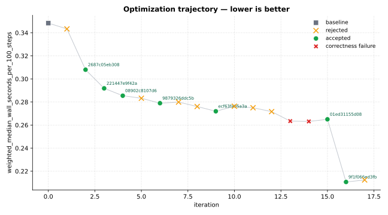
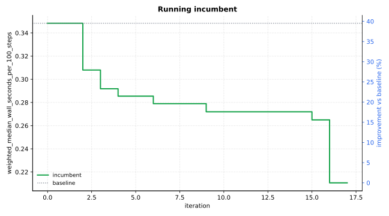

Optimization Report — lammps-optimize-tip4p
===========================================

Primary metric: ``weighted_median_wall_seconds_per_100_steps`` (lower is better).

Summary
-------

- baseline (``e7c0ed95a333``): ``0.34835``
- best accepted (``9f1f066ed3fb``): ``0.210648`` (+39.53% vs baseline)
- iterations: 18 total | 7 accepted | 8 rejected | 2 correctness failure

Trajectory
----------

All iterations
--------------

+------+--------------+---------------------+----------+----------------------------------------------------------------------------------------------------+
| iter | commit       | status              | metric   | summary                                                                                            |
+======+==============+=====================+==========+====================================================================================================+
| 0    | e7c0ed95a333 | baseline            | 0.34835  | baseline                                                                                           |
+------+--------------+---------------------+----------+----------------------------------------------------------------------------------------------------+
| 1    | 4fc731266013 | rejected            | 0.343359 | Replace per-step full-array TIP4P `hneigh[][2]` reset with a toggled per-step stamp in `pair_lj_c… |
+------+--------------+---------------------+----------+----------------------------------------------------------------------------------------------------+
| 2    | 2687c05eb308 | accepted            | 0.30797  | Ported OPT-style specialized inner-loop compute (`eval<...>` dispatch) into default `pair_lj_cut_… |
+------+--------------+---------------------+----------+----------------------------------------------------------------------------------------------------+
| 3    | 221447e9f42a | accepted            | 0.291823 | Flatten TIP4P long-pair hot-loop data access by using contiguous x/f [3]-views and hoisting per-i… |
+------+--------------+---------------------+----------+----------------------------------------------------------------------------------------------------+
| 4    | 08902c8107d6 | accepted            | 0.28545  | Precompute TIP4P oxygen virtual sites once per step in compute() and remove per-pair lazy hneigh … |
+------+--------------+---------------------+----------+----------------------------------------------------------------------------------------------------+
| 5    | 8d71f03effc0 | rejected            | 0.28324  | Reduce TIP4P long-pair hot-loop overhead by skipping LJ-row setup for hydrogen i-atoms and deferr… |
+------+--------------+---------------------+----------+----------------------------------------------------------------------------------------------------+
| 6    | 9879326ddc5b | accepted            | 0.278954 | Flatten TIP4P hneigh/newsite hot-path access to contiguous 2D views and use an sbmask common-case… |
+------+--------------+---------------------+----------+----------------------------------------------------------------------------------------------------+
| 7    | 3585a8c5c5c1 | rejected            | 0.279916 | Split `pair_lj_cut_tip4p_long::eval()` to make `sbmask==0` the explicit common-case fast path for… |
+------+--------------+---------------------+----------+----------------------------------------------------------------------------------------------------+
| 8    | 8a6135d96965 | rejected            | 0.276071 | Accumulate TIP4P i-oxygen hydrogen force-partition contributions in local scalars inside `pair_lj… |
+------+--------------+---------------------+----------+----------------------------------------------------------------------------------------------------+
| 9    | ecf63fa05a3a | accepted            | 0.271962 | Accumulate TIP4P i-water hydrogen force-partition contributions once per outer-i and reuse cached… |
+------+--------------+---------------------+----------+----------------------------------------------------------------------------------------------------+
| 10   | 2f934c4103da | rejected            | 0.276346 | Precompute and cache per-oxygen TIP4P virial-weighted coordinates (`vsite`) in `compute()` and re… |
+------+--------------+---------------------+----------+----------------------------------------------------------------------------------------------------+
| 11   | 9b22be955a6d | rejected            | 0.275011 | Reuse TIP4P precomputed M-site coordinates (`newsite` via `x1`/`x2`) for O-side virial accumulati… |
+------+--------------+---------------------+----------+----------------------------------------------------------------------------------------------------+
| 12   | 925356850619 | rejected            | 0.271648 | Add a non-O Coulomb fast path in `pair_lj_cut_tip4p_long::eval()` that uses a tighter `cut_coulsq… |
+------+--------------+---------------------+----------+----------------------------------------------------------------------------------------------------+
| 13   | 6bcb1eb9e1c7 | correctness_failure | 0.263433 | Tighten TIP4P Coulomb outer gating in `pair_lj_cut_tip4p_long::eval()` with pair-type-specific re… |
+------+--------------+---------------------+----------+----------------------------------------------------------------------------------------------------+
| 14   | 474a3d399ddc | correctness_failure | 0.26315  | Use measured per-step TIP4P M-site displacement to apply pair-type-specific Coulomb outer gates i… |
+------+--------------+---------------------+----------+----------------------------------------------------------------------------------------------------+
| 15   | 01ed31155d08 | accepted            | 0.264976 | Tighten non-O Coulomb outer gating to `cut_coulsq` and reuse precomputed H-coordinate sums for O-… |
+------+--------------+---------------------+----------+----------------------------------------------------------------------------------------------------+
| 16   | 9f1f066ed3fb | accepted            | 0.210648 | Refactor `pair_lj_cut_tip4p_long::eval()` Coulomb off-site reach handling to early-continue `i_is… |
+------+--------------+---------------------+----------+----------------------------------------------------------------------------------------------------+
| 17   | dc7a44533379 | rejected            | 0.212429 | Cache per-i TIP4P charge-site and per-neighbor x[j] coordinates as scalars in pair_lj_cut_tip4p_l… |
+------+--------------+---------------------+----------+----------------------------------------------------------------------------------------------------+

Accepted commits — detailed
---------------------------

.. toctree::
   :maxdepth: 1

   iterations/iter_0002_accepted
   iterations/iter_0003_accepted
   iterations/iter_0004_accepted
   iterations/iter_0006_accepted
   iterations/iter_0009_accepted
   iterations/iter_0015_accepted
   iterations/iter_0016_accepted

Contract
--------

Benchmark contract and runner used for this optimization:

- :download:`benchmark.yaml <contract/benchmark.yaml>`
- :download:`benchmark_runner.py <contract/benchmark_runner.py>`
- :download:`goal_inputs.json <contract/goal_inputs.json>`
- :download:`goal_analysis.json <contract/goal_analysis.json>`
- :download:`goal_mode.json <contract/goal_mode.json>`
- :download:`run_optimize.sh <contract/run_optimize.sh>`
- :download:`setup_env.sh <contract/setup_env.sh>`
- :download:`program.md <contract/program.md>`
- :download:`memory.md <contract/memory.md>`
- :download:`worker_memory.md <contract/worker_memory.md>`

Data
----

- :download:`results.tsv <data/results.tsv>`
- :download:`summary.json <data/summary.json>`
