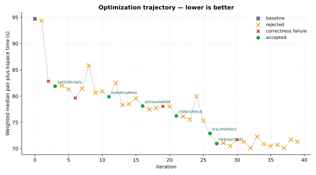
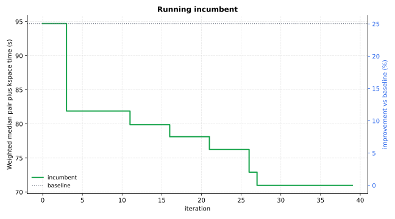

Optimization Report — lammps-tip4p
==================================


Primary metric: ``Weighted median pair plus kspace time (s)`` (lower is better).

Goal
----


Copied source goal for this optimization: :download:`goal.md <contract/goal.md>`

.. code-block:: markdown

   # Optimization Goal
   
   ## Package
   lammps
   
   ## Language
   cpp
   
   ## Target
   Optimize the TIP4P long-range water NVE workflow in LAMMPS, with primary focus on algorithm-level improvements inside `lj/cut/tip4p/long` and `pppm/tip4p`.
   
   The relevant hot paths in the local LAMMPS source tree are `src/KSPACE/pair_lj_cut_tip4p_long.cpp` and `src/KSPACE/pppm_tip4p.cpp`. Important repeated work includes TIP4P M-site construction during pair traversal, TIP4P-specific charge mapping, rho accumulation, and electric-field interpolation inside the PPPM solve.
   
   Primary optimization interest is reducing the combined pair-plus-kspace cost for fixed-size water systems while preserving the same physical model, long-range accuracy, timestep, and stable NVE behavior.
   
   This goal assumes benchmark generation will use the attached input artifacts by filename (`water_216_data.lmp`, `in.tip4p_nve`, and `in.tip4p_nve_long`) and resolve them from the staged goal input root.
   
   ## Editable Scope
   - src/KSPACE/pair_lj_cut_tip4p_long.cpp
   - src/KSPACE/pair_lj_cut_tip4p_long.h
   - src/KSPACE/pppm_tip4p.cpp
   - src/KSPACE/pppm_tip4p.h
   
   ## Performance Metric
   Minimize weighted median `pair_seconds + kspace_seconds` across all benchmark cases.
   
   Benchmark should also record `loop_seconds`, `pair_seconds`, `kspace_seconds`, `neigh_seconds`, `comm_seconds`, and normalized throughput (for example, steps/second or ns/day). Secondary objective should be lower `loop_seconds` without winning only through communication-side artifacts.
   
   ## Correctness Constraints
   - Preserve NVE energy behavior: total energy drift per atom per step over the longer runs must stay within benchmark tolerance versus incumbent baseline.
   - Preserve sampled thermo observables at matched output steps: `etotal`, `pe`, `ke`, `temp`, `press`, and `density` must stay within benchmark tolerance.
   - Preserve sampled force consistency for representative frames: RMS and max absolute force-component deltas must stay within benchmark tolerance.
   - Preserve trajectory invariants for identical initial state and deterministic seed: same atom count, stable completion, no lost atoms, and no NaN/Inf.
   - Do not change physical model semantics or runtime controls to gain speed: keep `pair_style lj/cut/tip4p/long`, `kspace_style pppm/tip4p 0.0001`, `neighbor 2.0 bin`, `timestep 0.5`, units, bonded terms, and TIP4P geometry assumptions unchanged.
   - Do not weaken long-range accuracy, neighbor rebuild safety, or Newton/communication semantics to gain speed.
   - All benchmark cases must complete successfully with deterministic runner settings.
   
   ## Representative Workloads
   - train-16r-short: `in.tip4p_nve` + `water_216_data.lmp` on 16 MPI ranks (216 waters replicated by `4x4x4` inside the input; short run) so pair plus PPPM work dominates more strongly than communication.
   - train-32r-short: `in.tip4p_nve` + `water_216_data.lmp` on 32 MPI ranks to keep the optimization useful across a second domain decomposition.
   - train-16r-long: `in.tip4p_nve_long` + `water_216_data.lmp` on 16 MPI ranks for a longer-horizon NVE drift and timer-stability case.
   - test-32r-long: `in.tip4p_nve_long` + `water_216_data.lmp` on 32 MPI ranks as a held-out moderate-decomposition case.
   - test-64r-short: `in.tip4p_nve` + `water_216_data.lmp` on 64 MPI ranks as a held-out scaling-sensitive case; this case should not define the primary optimization direction.
   
   ## Build
   ```bash
   mkdir -p build
   cd build
   cmake -C ../cmake/presets/most.cmake -C ../cmake/presets/nolib.cmake -D PKG_GPU=off ../cmake
   cmake --build . -j4
   ```
   
   ## Notes
   - Treat the attached LAMMPS input file(s) as the source of truth for runtime settings and any include-chain files.
   - This campaign is intended to find algorithm-level improvements inside the named TIP4P pair and PPPM kernels, not generic communication or integrator tuning.
   - Keep benchmark execution deterministic: fixed thread settings, fixed random seeds (if any), and explicit launch command.
   - Run LAMMPS with full timer output so the benchmark runner can parse `Pair`, `Kspace`, `Neigh`, `Comm`, and total loop timings from the standard timing table.
   - In generated benchmark YAML, include `runtime.pre_commands` derived from the build section so authoritative runs rebuild the edited LAMMPS binary before benchmarking.
   - In generated benchmark runtime command, invoke LAMMPS via MPI launcher with the case-specific rank count (16, 32, or 64), not one fixed rank count for every case.
   - Set `OMP_NUM_THREADS=1` unless a case explicitly requires hybrid MPI+OpenMP, and keep this setting identical across baseline/candidate runs.
   - In generated benchmark YAML, include a split block so worker sees the train cases only:
     ```yaml
     split:
       train_case_ids:
         - train-16r-short
         - train-32r-short
         - train-16r-long
     ```

Summary
-------


- baseline (`e7c0ed95a333 <summary-baseline-e7c0ed95a333_>`_): ``94.717``
- best accepted (`5840dac0d9f1 <summary-best-5840dac0d9f1_>`_): ``70.984`` (+25.06% vs baseline)
- published GitHub branch: `fermilink-optimize/lammps-tip4p <https://github.com/skilled-scipkg/lammps/tree/fermilink-optimize%2Flammps-tip4p>`_
- iterations: 40 total | 6 accepted | 29 rejected | 4 correctness failure

Optimization Trajectory
-----------------------






All iterations
--------------


+------+-------------------------------------------------+---------------------+--------+------------------------------------------------------------------------------------------------------------+
| iter | commit                                          | status              | metric | summary                                                                                                    |
+======+=================================================+=====================+========+============================================================================================================+
| 0    | `e7c0ed95a333 <iter-0000-table-e7c0ed95a333_>`_ | baseline            | 94.717 | baseline                                                                                                   |
+------+-------------------------------------------------+---------------------+--------+------------------------------------------------------------------------------------------------------------+
| 1    | 0157b0571dbb                                    | rejected            | 94.369 | Cache PPPM TIP4P virtual-site reconstruction and H-index lookup once per local oxygen per compute…         |
+------+-------------------------------------------------+---------------------+--------+------------------------------------------------------------------------------------------------------------+
| 2    | 2bbd33a175f2                                    | correctness_failure | 82.844 | Backport the serial OPT hot loop into base lj/cut/tip4p/long so the benchmarked pair kernel uses …         |
+------+-------------------------------------------------+---------------------+--------+------------------------------------------------------------------------------------------------------------+
| 3    | `3a45586c8afa <iter-0003-table-3a45586c8afa_>`_ | accepted            | 81.885 | Specialize \`pair_lj_cut_tip4p_long\` with compile-time energy/virial/table dispatch, a shared TIP4…       |
+------+-------------------------------------------------+---------------------+--------+------------------------------------------------------------------------------------------------------------+
| 4    | 847eb8e5dd4b                                    | rejected            | 81.985 | Cache local PPPM TIP4P M-site reconstruction and 1D rho stencils in particle_map() so make_rho(),…         |
+------+-------------------------------------------------+---------------------+--------+------------------------------------------------------------------------------------------------------------+
| 5    | 42d987d04a9c                                    | rejected            | 81.298 | Skip the extended TIP4P Coulomb precheck for exact non-oxygen/non-oxygen pairs in \`pair_lj_cut_ti…        |
+------+-------------------------------------------------+---------------------+--------+------------------------------------------------------------------------------------------------------------+
| 6    | 89aa52c5901e                                    | correctness_failure | 79.639 | Specialize \`pair_lj_cut_tip4p_long\` for the benchmark’s global-only tally path, fast-path exact n…       |
+------+-------------------------------------------------+---------------------+--------+------------------------------------------------------------------------------------------------------------+
| 7    | c37498ebee61                                    | rejected            | 81.445 | Keep the exact H-H Coulomb cutoff fast path in \`pair_lj_cut_tip4p_long\`, and reuse the first oxyg…       |
+------+-------------------------------------------------+---------------------+--------+------------------------------------------------------------------------------------------------------------+
| 8    | 7d859a5521df                                    | rejected            | 85.841 | Specialize \`pair_lj_cut_tip4p_long\` Coulomb handling by interaction class (\`O-O\`, \`O-H\`, \`H-O\`, a… |
+------+-------------------------------------------------+---------------------+--------+------------------------------------------------------------------------------------------------------------+
| 9    | 0356a6e5d35a                                    | rejected            | 80.674 | Tighten \`pair_lj_cut_tip4p_long\` Coulomb prechecks only for exact \`H-H\` and actual-current-step \`…    |
+------+-------------------------------------------------+---------------------+--------+------------------------------------------------------------------------------------------------------------+
| 10   | 25819367f233                                    | rejected            | 80.914 | Tighten exact oxygen-i/non-oxygen-j pair Coulomb prechecks in \`pair_lj_cut_tip4p_long\` and reuse …       |
+------+-------------------------------------------------+---------------------+--------+------------------------------------------------------------------------------------------------------------+
| 11   | `2a0b902a8b5a <iter-0011-table-2a0b902a8b5a_>`_ | accepted            | 79.88  | Tighten exact oxygen-to-nonoxygen Coulomb prechecks and add a dedicated water-H \`i\` fast path in …       |
+------+-------------------------------------------------+---------------------+--------+------------------------------------------------------------------------------------------------------------+
| 12   | 4f3910700624                                    | rejected            | 82.549 | Prune impossible hydrogen-neighbor LJ work and reuse cached oxygen M-sites to tighten reverse non…         |
+------+-------------------------------------------------+---------------------+--------+------------------------------------------------------------------------------------------------------------+
| 13   | c467f241b716                                    | rejected            | 78.33  | Skip dead water-H LJ work in \`pair_lj_cut_tip4p_long\` and cache PPPM TIP4P oxygen \`find_M()\` / H-…     |
+------+-------------------------------------------------+---------------------+--------+------------------------------------------------------------------------------------------------------------+
| 14   | b11c640621e4                                    | rejected            | 78.535 | Skip dead hydrogen-neighbor LJ work in \`pair_lj_cut_tip4p_long\` and replace the heavier PPPM full…       |
+------+-------------------------------------------------+---------------------+--------+------------------------------------------------------------------------------------------------------------+
| 15   | 48e378f90ae8                                    | rejected            | 79.58  | Add an IK-only PPPM TIP4P oxygen cache that stores per-step H indices, lower-left grid deltas, an…         |
+------+-------------------------------------------------+---------------------+--------+------------------------------------------------------------------------------------------------------------+
| 16   | `ab55ea3e8508 <iter-0016-table-ab55ea3e8508_>`_ | accepted            | 78.12  | Restore safe hydrogen-neighbor LJ pruning in \`pair_lj_cut_tip4p_long\` and reuse cached TIP4P oxyg…       |
+------+-------------------------------------------------+---------------------+--------+------------------------------------------------------------------------------------------------------------+
| 17   | ad7811dc14f3                                    | rejected            | 77.512 | Generation-stamped TIP4P pair/PPPM caches plus a common non-special pair fast path and cross-step…         |
+------+-------------------------------------------------+---------------------+--------+------------------------------------------------------------------------------------------------------------+
| 18   | b87604e6465e                                    | rejected            | 77.755 | Pair-only TIP4P optimization: replace the per-step \`hneigh[][2]\` reset with generation-stamped ca…       |
+------+-------------------------------------------------+---------------------+--------+------------------------------------------------------------------------------------------------------------+
| 19   | 1478ab81846a                                    | correctness_failure | 78.069 | Buffer hydrogen-i Coulomb force accumulation in pair_lj_cut_tip4p_long and flush once after the n…         |
+------+-------------------------------------------------+---------------------+--------+------------------------------------------------------------------------------------------------------------+
| 20   | 57da41d1ad04                                    | rejected            | 78.045 | Cache all-charge PPPM/TIP4P IK rho stencils and base brick indices in make_rho() and reuse them i…         |
+------+-------------------------------------------------+---------------------+--------+------------------------------------------------------------------------------------------------------------+
| 21   | `2599e1f9f4c8 <iter-0021-table-2599e1f9f4c8_>`_ | accepted            | 76.248 | Use contiguous alias-friendly x/f/part2grid views in pair_lj_cut_tip4p_long and TIP4P PPPM partic…         |
+------+-------------------------------------------------+---------------------+--------+------------------------------------------------------------------------------------------------------------+
| 22   | 22ab6a7a53b5                                    | rejected            | 76.144 | Reuse the pair style's current-step TIP4P O/H/M cache inside PPPM with a timestep guard and ortho…         |
+------+-------------------------------------------------+---------------------+--------+------------------------------------------------------------------------------------------------------------+
| 23   | bd8ee0840992                                    | rejected            | 75.536 | Merge the correctness-clean pair-only generation-stamped TIP4P site cache and common non-special-…         |
+------+-------------------------------------------------+---------------------+--------+------------------------------------------------------------------------------------------------------------+
| 24   | a4391bb48f95                                    | rejected            | 79.984 | Specialize TIP4P PPPM order-5 make_rho()/fieldforce_ik() stencil kernels with a generic fallback           |
+------+-------------------------------------------------+---------------------+--------+------------------------------------------------------------------------------------------------------------+
| 25   | 757c16f42b32                                    | rejected            | 75.36  | Pure-water \`lj/cut/tip4p/long\` pair fast path plus generation-stamped TIP4P M-site reuse and comm…       |
+------+-------------------------------------------------+---------------------+--------+------------------------------------------------------------------------------------------------------------+
| 26   | `4cbc0fa85603 <iter-0026-table-4cbc0fa85603_>`_ | accepted            | 72.919 | Contiguous generation-stamped TIP4P pair/PPPM caches plus a pure-water lj/cut/tip4p/long pair fas…         |
+------+-------------------------------------------------+---------------------+--------+------------------------------------------------------------------------------------------------------------+
| 27   | `5840dac0d9f1 <iter-0027-table-5840dac0d9f1_>`_ | accepted            | 70.984 | Inline TIP4P pair/PPPM cache-hit fast paths while keeping cache-miss reconstruction in dedicated …         |
+------+-------------------------------------------------+---------------------+--------+------------------------------------------------------------------------------------------------------------+
| 28   | aaa3d5fa36f1                                    | rejected            | 71.085 | Streamline PPPMTIP4P by removing the unconditional particle_map() allreduce and specializing the …         |
+------+-------------------------------------------------+---------------------+--------+------------------------------------------------------------------------------------------------------------+
| 29   | b9d56dcc532a                                    | rejected            | 70.525 | Use typed alias-friendly cached TIP4P M-site views in pair_lj_cut_tip4p_long and pppm_tip4p while…         |
+------+-------------------------------------------------+---------------------+--------+------------------------------------------------------------------------------------------------------------+
| 30   | b028e7ec4bbc                                    | correctness_failure | 71.716 | Cache per-step TIP4P O->M deltas/reach in pair_lj_cut_tip4p_long and reuse them to form exact oxy…         |
+------+-------------------------------------------------+---------------------+--------+------------------------------------------------------------------------------------------------------------+
| 31   | 9eb54352a2e0                                    | rejected            | 71.282 | Precompute map-resolvable TIP4P oxygen M-sites before the pair loop and read the prepared cache d…         |
+------+-------------------------------------------------+---------------------+--------+------------------------------------------------------------------------------------------------------------+
| 32   | 8bfdf92c40a5                                    | rejected            | 70.124 | Defer cached TIP4P hydrogen-index loads until exact oxygen interactions pass the final Coulomb cu…         |
+------+-------------------------------------------------+---------------------+--------+------------------------------------------------------------------------------------------------------------+
| 33   | ff67ca3c0752                                    | rejected            | 72.294 | Defer TIP4P pair hydrogen-index loads until exact oxygen-cutoff hits, add a common nonspecial Cou…         |
+------+-------------------------------------------------+---------------------+--------+------------------------------------------------------------------------------------------------------------+
| 34   | 625e91025a03                                    | rejected            | 70.877 | Split TIP4P pair/PPPM caches into compact M-site coordinate arrays plus separate H-index/stamp st…         |
+------+-------------------------------------------------+---------------------+--------+------------------------------------------------------------------------------------------------------------+
| 35   | 44b554c8a168                                    | rejected            | 70.511 | Defer pair-side TIP4P hydrogen-index and Coulomb-special loads until exact oxygen-path survivors,…         |
+------+-------------------------------------------------+---------------------+--------+------------------------------------------------------------------------------------------------------------+
| 36   | d6aa774723cb                                    | rejected            | 70.737 | Use the lazy TIP4P pair/PPPM cache-access shape with an xM-only PPPM particle_map accessor, and h…         |
+------+-------------------------------------------------+---------------------+--------+------------------------------------------------------------------------------------------------------------+
| 37   | e04c1aedddd3                                    | rejected            | 70.108 | Compose typed alias-friendly TIP4P cached M-site coordinates with lazy pair-side hydrogen-index u…         |
+------+-------------------------------------------------+---------------------+--------+------------------------------------------------------------------------------------------------------------+
| 38   | 095bee6d96dc                                    | rejected            | 71.763 | Lazy TIP4P xM-only cache access plus pair hydrogen-index deferral and PPPM stencil-base reuse              |
+------+-------------------------------------------------+---------------------+--------+------------------------------------------------------------------------------------------------------------+
| 39   | 7c4d21219695                                    | rejected            | 71.327 | Split TIP4P pair/PPPM cache hits into xM-only versus hydrogen-index reads, and memoize the pair-s…         |
+------+-------------------------------------------------+---------------------+--------+------------------------------------------------------------------------------------------------------------+

Accepted Commits
----------------


Accepted candidate detail pages and current manual-review status:

+-----------------------------------------------------+----------------------------------------+
| accepted commit                                     | Human verification                     |
+=====================================================+========================================+
| :doc:`3a45586c8afa <iterations/iter_0003_accepted>` | not verified                           |
+-----------------------------------------------------+----------------------------------------+
| :doc:`2a0b902a8b5a <iterations/iter_0011_accepted>` | not verified                           |
+-----------------------------------------------------+----------------------------------------+
| :doc:`ab55ea3e8508 <iterations/iter_0016_accepted>` | not verified                           |
+-----------------------------------------------------+----------------------------------------+
| :doc:`2599e1f9f4c8 <iterations/iter_0021_accepted>` | not verified                           |
+-----------------------------------------------------+----------------------------------------+
| :doc:`4cbc0fa85603 <iterations/iter_0026_accepted>` | not verified                           |
+-----------------------------------------------------+----------------------------------------+
| :doc:`5840dac0d9f1 <iterations/iter_0027_accepted>` | not verified                           |
+-----------------------------------------------------+----------------------------------------+

.. toctree::
   :maxdepth: 1
   :hidden:

   iterations/iter_0003_accepted
   iterations/iter_0011_accepted
   iterations/iter_0016_accepted
   iterations/iter_0021_accepted
   iterations/iter_0026_accepted
   iterations/iter_0027_accepted

Benchmark Contracts
-------------------


Benchmark contract and runner used for this optimization:

- :download:`benchmark.yaml <contract/benchmark.yaml>`
- :download:`benchmark_runner.py <contract/benchmark_runner.py>`
- :download:`goal.md <contract/goal.md>`

Input files for Benchmarks
--------------------------


Copied auxiliary benchmark inputs from ``.fermilink-optimize/inputs/all/``:

- :download:`in.tip4p_nve <inputs/all/in.tip4p_nve>`
- :download:`in.tip4p_nve_long <inputs/all/in.tip4p_nve_long>`
- :download:`water_216_data.lmp <inputs/all/water_216_data.lmp>`

Runtime Data
------------


- :download:`results.tsv <data/results.tsv>`
- :download:`summary.json <data/summary.json>`

Rerun Guide
-----------


Agent provider ``codex``; model ``gpt-5.4-xhigh``

Use the bundled contract files from this report to recreate the optimization against a fresh upstream checkout.

- default upstream clone: ``git@github.com:skilled-scipkg/lammps.git``
- confirm the upstream default branch before creating the worktree: `develop on GitHub <https://github.com/skilled-scipkg/lammps/tree/develop>`_
- detected package language: ``cpp``; use ``fermilink-optimize-cpp`` for goal-mode reruns
- ``contract/run_optimize.sh`` and ``contract/setup_env.sh`` record the original campaign, but they can contain site-specific absolute paths
- if :download:`goal_inputs.json <contract/goal_inputs.json>` is present, restage the listed auxiliary workload files before rerunning
- copied benchmark input files are bundled under ``inputs/all/`` and should be restored into ``.fermilink-optimize/inputs/all/`` for deterministic reruns

.. code-block:: bash

   git clone git@github.com:skilled-scipkg/lammps.git
   cd lammps
   git worktree add -b fermilink-optimize/lammps-<modified-feature> ../lammps-<modified-feature> develop

Path 1: rerun from the bundled :download:`goal.md <contract/goal.md>`.

Run this from the cloned main repo so the launcher can create or reuse the sibling worktree:

.. code-block:: bash

   fermilink-optimize-cpp \
     --project-root "$PWD" \
     --goal /path/to/report/contract/goal.md \
     --branch fermilink-optimize/lammps-<modified-feature> \
     --worktree-root .. \
     --worktree-name lammps-<modified-feature>

Path 2: rerun more deterministically from the copied :download:`benchmark.yaml <contract/benchmark.yaml>` and :download:`benchmark_runner.py <contract/benchmark_runner.py>`.

This avoids regenerating the benchmark contract from ``goal.md`` before the campaign starts:

.. code-block:: bash

   cd ../lammps-<modified-feature>
   mkdir -p .fermilink-optimize/autogen .fermilink-optimize/inputs/all
   cp /path/to/report/contract/benchmark.yaml .fermilink-optimize/autogen/benchmark.yaml
   cp /path/to/report/contract/benchmark_runner.py .fermilink-optimize/autogen/benchmark_runner.py
   cp -R /path/to/report/inputs/all/. .fermilink-optimize/inputs/all/
   printf '%s\n' '.fermilink-optimize/' >> .git/info/exclude
   fermilink optimize lammps "$PWD" \
     --benchmark "$PWD/.fermilink-optimize/autogen/benchmark.yaml" \
     --skills-source existing

Building environment
~~~~~~~~~~~~~~~~~~~~


These commands come from the copied ``## Build`` block in :download:`goal.md <contract/goal.md>` and are rerun before benchmarks through the benchmark configuration.

Check that they work in your local environment before launching a long run. If they do not, update the ``## Build`` section in ``goal.md`` or the corresponding ``runtime.pre_commands`` setting in :download:`benchmark.yaml <contract/benchmark.yaml>`.

.. code-block:: bash

   mkdir -p build
   cd build
   cmake -C ../cmake/presets/most.cmake -C ../cmake/presets/nolib.cmake -D PKG_GPU=off ../cmake
   cmake --build . -j4

Benchmark Examples
------------------


Worker iterations run the ``train-*`` benchmark cases below while searching for candidate changes:

.. code-block:: yaml

   cases:
     - id: train-16r-short
       weight: 1.0
       input_script: in.tip4p_nve
       data_file: water_216_data.lmp
       mpi_ranks: 16
       omp_num_threads: 1
       expected_atoms: 41472
       run_steps: 1200
       thermo_every: 100
       timer_mode: full
       timestep: 0.5
       pair_style: lj/cut/tip4p/long 1 2 1 1 0.278072379 17.007
       kspace_style: pppm/tip4p 0.0001
       neighbor: 2.0 bin
       pppm_diff_mode: ik
       replicate:
         - 4
         - 4
         - 4
     - id: train-32r-short
       weight: 1.0
       input_script: in.tip4p_nve
       data_file: water_216_data.lmp
       mpi_ranks: 32
       omp_num_threads: 1
       expected_atoms: 41472
       run_steps: 1200
       thermo_every: 100
       timer_mode: full
       timestep: 0.5
       pair_style: lj/cut/tip4p/long 1 2 1 1 0.278072379 17.007
       kspace_style: pppm/tip4p 0.0001
       neighbor: 2.0 bin
       pppm_diff_mode: ik
       replicate:
         - 4
         - 4
         - 4
     - id: train-16r-long
       weight: 1.0
       input_script: in.tip4p_nve_long
       data_file: water_216_data.lmp
       mpi_ranks: 16
       omp_num_threads: 1
       expected_atoms: 41472
       run_steps: 10000
       thermo_every: 100
       timer_mode: full
       timestep: 0.5
       pair_style: lj/cut/tip4p/long 1 2 1 1 0.278072379 17.007
       kspace_style: pppm/tip4p 0.0001
       neighbor: 2.0 bin
       pppm_diff_mode: ik
       replicate:
         - 4
         - 4
         - 4

Controller reviews run the ``test-*`` benchmark cases below to validate accepted candidates:

.. code-block:: yaml

   cases:
     - id: test-32r-long
       weight: 0.5
       input_script: in.tip4p_nve_long
       data_file: water_216_data.lmp
       mpi_ranks: 32
       omp_num_threads: 1
       expected_atoms: 41472
       run_steps: 10000
       thermo_every: 100
       timer_mode: full
       timestep: 0.5
       pair_style: lj/cut/tip4p/long 1 2 1 1 0.278072379 17.007
       kspace_style: pppm/tip4p 0.0001
       neighbor: 2.0 bin
       pppm_diff_mode: ik
       replicate:
         - 4
         - 4
         - 4
     - id: test-64r-short
       weight: 0.25
       input_script: in.tip4p_nve
       data_file: water_216_data.lmp
       mpi_ranks: 64
       omp_num_threads: 1
       expected_atoms: 41472
       run_steps: 1200
       thermo_every: 100
       timer_mode: full
       timestep: 0.5
       pair_style: lj/cut/tip4p/long 1 2 1 1 0.278072379 17.007
       kspace_style: pppm/tip4p 0.0001
       neighbor: 2.0 bin
       pppm_diff_mode: ik
       replicate:
         - 4
         - 4
         - 4


.. _summary-baseline-e7c0ed95a333: https://github.com/skilled-scipkg/lammps/commit/e7c0ed95a333
.. _summary-best-5840dac0d9f1: https://github.com/skilled-scipkg/lammps/commit/5840dac0d9f1
.. _iter-0000-table-e7c0ed95a333: https://github.com/skilled-scipkg/lammps/commit/e7c0ed95a333
.. _iter-0003-table-3a45586c8afa: https://github.com/skilled-scipkg/lammps/commit/3a45586c8afa
.. _iter-0011-table-2a0b902a8b5a: https://github.com/skilled-scipkg/lammps/commit/2a0b902a8b5a
.. _iter-0016-table-ab55ea3e8508: https://github.com/skilled-scipkg/lammps/commit/ab55ea3e8508
.. _iter-0021-table-2599e1f9f4c8: https://github.com/skilled-scipkg/lammps/commit/2599e1f9f4c8
.. _iter-0026-table-4cbc0fa85603: https://github.com/skilled-scipkg/lammps/commit/4cbc0fa85603
.. _iter-0027-table-5840dac0d9f1: https://github.com/skilled-scipkg/lammps/commit/5840dac0d9f1
