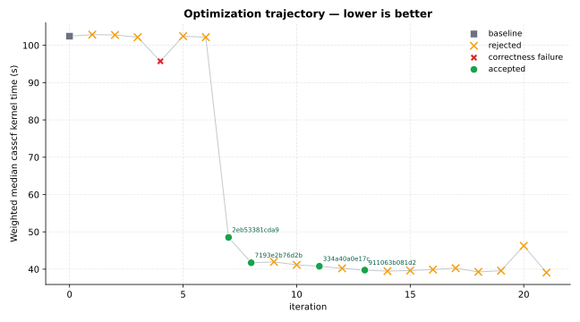
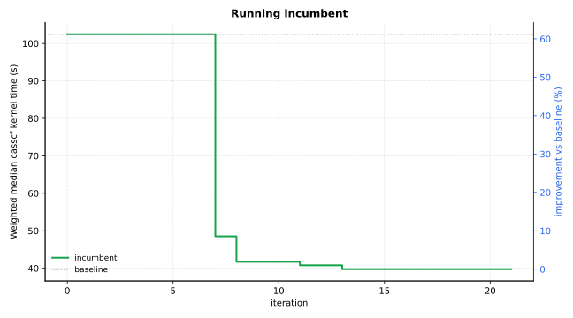

Optimization Report — pyscf-casscf
==================================

.. note::

   The optimized code summarized in this report was generated by the FermiLink AI agent. Review and validate the code changes yourself before using the modified code in scientific or production work. This optimization reporting feature is experimental and is not a final, mature solution.

Primary metric: ``Weighted median casscf kernel time (s)`` (lower is better).

Goal
----


Copied source goal for this optimization: :download:`goal.md <contract/goal.md>`

.. code-block:: markdown

   # Optimization Goal
   
   ## Package
   pyscf
   
   ## Language
   python
   
   ## Target
   Optimize PySCF CASSCF convergence behavior and end-to-end runtime, with primary focus on the matrix-free second-order / CIAH solver in `pyscf/mcscf/newton_casscf.py` and the one-step / two-step macro-micro iteration control flow in `pyscf/mcscf/mc1step.py`.
   
   Prioritize algorithmic and numerical improvements that reduce wasted iterations without changing the scientific target:
   - more stable augmented-Hessian / CIAH preconditioning using inexpensive diagonal, orbital-gap, active-space, or response information without forming the full orbital Hessian
   - more reliable handling of near-redundant orbital rotations, tiny denominators, and indefinite local curvature
   - better trust-region, step-acceptance, and keyframe-recovery behavior so difficult cases reach the same stationary point with fewer macroiterations and AH microiterations
   - lower wasted CASCI, Hessian-vector, and restart work through smarter reuse of existing solver state when that does not change the mathematical problem
   - safer state-specific and state-averaged root handling through overlap-aware diagnostics and root tracking
   
   Out of scope:
   - loosening CASSCF, AH, or FCI tolerances or increasing iteration limits to win the benchmark
   - replacing CASSCF with CASCI, DMRG, selected CI, reduced active spaces, or molecule-specific shortcuts
   - broad unrelated changes to SCF, integral generation, or non-MCSCF modules unless required by the same solver path
   
   ## Editable Scope
   - pyscf/mcscf/newton_casscf.py
   - pyscf/mcscf/newton_casscf_symm.py
   - pyscf/mcscf/mc1step.py
   - pyscf/mcscf/mc1step_symm.py
   - pyscf/mcscf/addons.py
   - pyscf/mcscf/casci.py
   - pyscf/soscf/ciah.py
   - pyscf/lib/linalg_helper.py
   
   ## Performance Metric
   Minimize `weighted_median_casscf_kernel_seconds`, defined as the weighted median of per-case end-to-end solver wall time measured from the selected CASSCF call (`mc.mc1step()`, `mc.mc2step()`, or `mc.newton().kernel()`) until convergence, after molecule construction, RHF or ROHF setup, and active-orbital selection are complete.
   
   Secondary objectives:
   - lower `macro_cycles`, `micro_cycles`, `ah_seconds`, `h_op_calls`, `casci_seconds`, `ao2mo_seconds`, `keyframe_restarts`, and `rejected_steps` when the runner can expose them
   - preserve convergence and root identity on every representative case
   
   ## Correctness Constraints
   - All benchmark cases must converge in the incumbent baseline and in accepted candidates under the stated `conv_tol`, `conv_tol_grad`, `max_cycle_macro`, `max_cycle_micro`, and AH settings.
   - Single-state final total CASSCF energy absolute delta must be <= `5e-8` Hartree versus the incumbent baseline.
   - State-averaged final total energy absolute delta must be <= `1e-7` Hartree, and per-state energy absolute delta must be <= `5e-6` Hartree, when the runner exposes `e_states`.
   - Final orbital-gradient norm and CI-gradient norm must remain no worse than the workload convergence thresholds when the runner exposes them.
   - Preserve the same molecule, basis, charge, spin, symmetry flag, active electron count, active orbital count, state weights, target root, solver family, and initial orbital sorting or projection path as the baseline workload.
   - Root matching for state-specific excited-root or state-averaged cases must use overlaps when comparable vectors are available; sorted-energy-only matching is not sufficient on crowded cases.
   - Do not loosen `conv_tol`, `conv_tol_grad`, `fcisolver.conv_tol`, `max_cycle_macro`, `max_cycle_micro`, `max_stepsize`, `ah_conv_tol`, `ah_lindep`, `ah_level_shift`, `ah_start_tol`, `ah_start_cycle`, `ah_max_cycle`, `nroots`, state weights, `fix_spin_`, `wfnsym`, or `internal_rotation`.
   - Do not replace Newton-CASSCF with an easier solver, reduce the number of states, alter active-space selection, disable scheduler callbacks, or change public API behavior to gain speed.
   - No case-specific shortcuts keyed on molecule identity, bond length, basis, active space, root number, or whether a case is `train-` or `test-`.
   
   ## Representative Workloads
   - train-newton-benzene-6-31g-cas66-pi-sort: Benzene geometry and active-orbital sort from `examples/mcscf/17-approx_orbital_hessian.py`; RHF; `basis='6-31g'`; `symmetry=True`; CAS(6o,6e); fixed active-orbital sort `[17,20,21,22,23,30]`; run `mc.newton().kernel(mo)`; optional comparison against `mcscf.approx_hessian(mcscf.CASSCF(...)).kernel(mo)`; purpose: larger AO/virtual orbital space with a small exact-FCI CAS, useful for testing matrix-free AH/preconditioner behavior without making the CI solve the bottleneck.
   ```python
   atom = """
   C -0.65830719  0.61123287 -0.00800148
   C  0.73685281  0.61123287 -0.00800148
   C  1.43439081  1.81898387 -0.00800148
   C  0.73673681  3.02749287 -0.00920048
   C -0.65808819  3.02741487 -0.00967948
   C -1.35568919  1.81920887 -0.00868348
   H -1.20806619 -0.34108413 -0.00755148
   H  1.28636081 -0.34128013 -0.00668648
   H  2.53407081  1.81906387 -0.00736748
   H  1.28693681  3.97963587 -0.00925948
   H -1.20821019  3.97969587 -0.01063248
   H -2.45529319  1.81939187 -0.00886348
   """
   ```
   - test-newton-benzene-ccpvtz-cas66-pi-sort: Benzene geometry and active-orbital sort from `examples/mcscf/17-approx_orbital_hessian.py`; RHF; `basis='ccpvtz'`; `symmetry=True`; CAS(6o,6e); fixed active-orbital sort `[17,20,21,22,23,30]`; run `mc.newton().kernel(mo)`; optional comparison against `mcscf.approx_hessian(mcscf.CASSCF(...)).kernel(mo)`; purpose: larger AO/virtual orbital space with a small exact-FCI CAS, useful for testing matrix-free AH/preconditioner behavior without making the CI solve the bottleneck.
   ```python
   atom = """
   C -0.65830719  0.61123287 -0.00800148
   C  0.73685281  0.61123287 -0.00800148
   C  1.43439081  1.81898387 -0.00800148
   C  0.73673681  3.02749287 -0.00920048
   C -0.65808819  3.02741487 -0.00967948
   C -1.35568919  1.81920887 -0.00868348
   H -1.20806619 -0.34108413 -0.00755148
   H  1.28636081 -0.34128013 -0.00668648
   H  2.53407081  1.81906387 -0.00736748
   H  1.28693681  3.97963587 -0.00925948
   H -1.20821019  3.97969587 -0.01063248
   H -2.45529319  1.81939187 -0.00886348
   """
   ```
   
   ## Build
   ```bash
   export SOURCE_REPO_ROOT="$(cd "$(git rev-parse --git-common-dir)/.." && pwd)"
   export VENV="/anvil/scratch/x-tli22/fermilink_optimize/project_pyscf_casscf/venvs/fermilink-optimize/pyscf-casscf"
   source "$VENV/bin/activate"
   module remove cmake
   cd pyscf/lib
   mkdir -p build
   cd build
   cmake ..
   cmake --build . -j4
   cd ../../../
   python -m pip install -e .
   ```
   
   ## Notes
   - Keep benchmark behavior deterministic with `OMP_NUM_THREADS=16`, `OPENBLAS_NUM_THREADS=1`, `MKL_NUM_THREADS=1`, and `NUMEXPR_NUM_THREADS=1`.
   - Run the `## Build` commands from the PySCF repo root inside the campaign's active environment; the generated benchmark should use explicit build pre-commands derived from this section.
   - Preserve the `train-` and `test-` ids directly and let FermiLink infer the split from the prefixes; do not add a manual `split` block when every case already uses those prefixes.
   - Time only the selected CASSCF solver call after molecule setup, SCF setup, and active-orbital selection are complete.
   - If the runner can expose them, record per-case `casscf_kernel_seconds`, `macro_cycles`, `micro_cycles`, `ah_seconds`, `h_op_calls`, `casci_seconds`, `ao2mo_seconds`, `keyframe_restarts`, `rejected_steps`, `converged`, `e_tot`, `e_states`, `norm_gorb`, `norm_gci`, and root-overlap diagnostics.
   - Keep the initial optimize benchmark to fixed-geometry cases that finish reproducibly in repeated local runs; do not include whole geometry scans, multistage homotopy schedules, or very heavy Cr2-style stress cases in the initial autogen suite.
   - If a listed case proves baseline-nonreproducible on the target machine, replace it before the campaign starts with a nearby fixed-geometry case in the same CASSCF regime rather than weakening tolerances or broadening the editable scope.

Summary
-------


- baseline (`44c83aaae41f <summary-baseline-44c83aaae41f_>`_): ``102.444``
- best accepted (`911063b081d2 <summary-best-911063b081d2_>`_): ``39.7457`` (+61.20% vs baseline)
- published GitHub branch: `fermilink-optimize/pyscf-casscf <https://github.com/skilled-scipkg/pyscf/tree/fermilink-optimize%2Fpyscf-casscf>`_
- iterations: 22 total | 4 accepted | 16 rejected | 1 correctness failure

Optimization Trajectory
-----------------------






All iterations
--------------


+------+-------------------------------------------------+---------------------+---------+----------------------------------------------------------------------------------------------------+
| iter | commit                                          | status              | metric  | summary                                                                                            |
+======+=================================================+=====================+=========+====================================================================================================+
| 0    | `44c83aaae41f <iter-0000-table-44c83aaae41f_>`_ | baseline            | 102.444 | baseline                                                                                           |
+------+-------------------------------------------------+---------------------+---------+----------------------------------------------------------------------------------------------------+
| 1    | fdc4b31c84b8                                    | rejected            | 102.853 | Vectorize incore Newton-CASSCF Hessian-vector ERI contractions while preserving the out-of-core f… |
+------+-------------------------------------------------+---------------------+---------+----------------------------------------------------------------------------------------------------+
| 2    | 77d0fdfe785d                                    | rejected            | 102.771 | Optimize Newton-CASSCF Hessian-vector H_co JK contraction by exploiting sparse core-response rows  |
+------+-------------------------------------------------+---------------------+---------+----------------------------------------------------------------------------------------------------+
| 3    | f6b960fe047c                                    | rejected            | 102.157 | Skip redundant final Newton-CASSCF AO2MO/CASCI after a no-step keyframe-gradient check             |
+------+-------------------------------------------------+---------------------+---------+----------------------------------------------------------------------------------------------------+
| 4    | 0e0c3c0191da                                    | correctness_failure | 95.7243 | Honor the already scaled Newton-CASSCF inner AH gradient stop target in update_orb_ci instead of … |
+------+-------------------------------------------------+---------------------+---------+----------------------------------------------------------------------------------------------------+
| 5    | c08bd5458630                                    | rejected            | 102.44  | Split Newton-CASSCF AH JK response into independent dm3/dm4 contractions and skip redundant termi… |
+------+-------------------------------------------------+---------------------+---------+----------------------------------------------------------------------------------------------------+
| 6    | a3ed2ebcaf36                                    | rejected            | 102.163 | Reassociate Newton-CASSCF AH Hessian-vector density products over core/active support and skip re… |
+------+-------------------------------------------------+---------------------+---------+----------------------------------------------------------------------------------------------------+
| 7    | `2eb53381cda9 <iter-0007-table-2eb53381cda9_>`_ | accepted            | 48.5098 | Use lazy density-fitted JK for Newton-CASSCF AH Hessian-vector response contractions while keepin… |
+------+-------------------------------------------------+---------------------+---------+----------------------------------------------------------------------------------------------------+
| 8    | `7193e2b76d2b <iter-0008-table-7193e2b76d2b_>`_ | accepted            | 41.7139 | Factorize large Newton-CASSCF AH density-fitted JK response builds over low-rank dm3/dm4 factors,… |
+------+-------------------------------------------------+---------------------+---------+----------------------------------------------------------------------------------------------------+
| 9    | db1c93a03725                                    | rejected            | 41.9501 | Batch Newton-CASSCF low-rank AH DF-JK factor transforms across response densities to reduce per-b… |
+------+-------------------------------------------------+---------------------+---------+----------------------------------------------------------------------------------------------------+
| 10   | 7ed98d8c2d85                                    | rejected            | 41.1557 | Cache Newton-CASSCF low-rank AH density-fitted response intermediates by reusing unpacked AO DF b… |
+------+-------------------------------------------------+---------------------+---------+----------------------------------------------------------------------------------------------------+
| 11   | `334a40a0e17c <iter-0011-table-334a40a0e17c_>`_ | accepted            | 40.7776 | Materialize exact Newton-CASSCF outcore ppaa/papa AO2MO datasets into guarded in-memory NumPy arr… |
+------+-------------------------------------------------+---------------------+---------+----------------------------------------------------------------------------------------------------+
| 12   | a60cd89bb8c2                                    | rejected            | 40.2259 | Vectorize exact Newton-CASSCF AH H_co contractions over materialized ppaa/papa tensors while pres… |
+------+-------------------------------------------------+---------------------+---------+----------------------------------------------------------------------------------------------------+
| 13   | `911063b081d2 <iter-0013-table-911063b081d2_>`_ | accepted            | 39.7457 | Cache per-AO2MO low-rank DF A-side transforms and use cached materialized ppaa/papa slices to vec… |
+------+-------------------------------------------------+---------------------+---------+----------------------------------------------------------------------------------------------------+
| 14   | 188c01d21e99                                    | rejected            | 39.4836 | Guard exact Newton-CASSCF outcore AO2MO to build ppaa/papa directly as same-run in-memory arrays,… |
+------+-------------------------------------------------+---------------------+---------+----------------------------------------------------------------------------------------------------+
| 15   | e06fb6d6e54d                                    | rejected            | 39.6404 | Incremental exact direct-JK updates for Newton-CASSCF keyframe gradients plus BLAS vectorization … |
+------+-------------------------------------------------+---------------------+---------+----------------------------------------------------------------------------------------------------+
| 16   | dd9e49defdfb                                    | rejected            | 39.8904 | Guarded vectorized Newton-CASSCF gen_g_hop setup over same-run materialized exact ppaa/papa tenso… |
+------+-------------------------------------------------+---------------------+---------+----------------------------------------------------------------------------------------------------+
| 17   | ccb1454453cd                                    | rejected            | 40.264  | Skip redundant terminal Newton-CASSCF AO2MO/CASCI when no microstep is taken at strict gradient c… |
+------+-------------------------------------------------+---------------------+---------+----------------------------------------------------------------------------------------------------+
| 18   | 3d3efe61c91f                                    | rejected            | 39.2684 | Cache exact per-AO2MO hcore MO transforms on Newton-CASSCF ERIS objects and reuse them in gen_g_h… |
+------+-------------------------------------------------+---------------------+---------+----------------------------------------------------------------------------------------------------+
| 19   | f4c984052a2a                                    | rejected            | 39.5938 | Same-state Newton-CASSCF reuse: cache exact per-ERIS hcore MO transforms and skip the redundant A… |
+------+-------------------------------------------------+---------------------+---------+----------------------------------------------------------------------------------------------------+
| 20   | 0e6acc89cdae                                    | rejected            | 46.2534 | Project large-AO low-rank Newton-CASSCF AH DF exchange directly into the required MO K blocks ins… |
+------+-------------------------------------------------+---------------------+---------+----------------------------------------------------------------------------------------------------+
| 21   | b7da83d5ec68                                    | rejected            | 39.0866 | Cache same-run Newton-CASSCF invariant DF/hcore intermediates and canonicalize from the exact MO-… |
+------+-------------------------------------------------+---------------------+---------+----------------------------------------------------------------------------------------------------+

Accepted Commits
----------------


Accepted candidate detail pages and current manual-review status:

+-----------------------------------------------------+----------------------------------------+
| accepted commit                                     | Human verification                     |
+=====================================================+========================================+
| :doc:`2eb53381cda9 <iterations/iter_0007_accepted>` | not verified                           |
+-----------------------------------------------------+----------------------------------------+
| :doc:`7193e2b76d2b <iterations/iter_0008_accepted>` | not verified                           |
+-----------------------------------------------------+----------------------------------------+
| :doc:`334a40a0e17c <iterations/iter_0011_accepted>` | not verified                           |
+-----------------------------------------------------+----------------------------------------+
| :doc:`911063b081d2 <iterations/iter_0013_accepted>` | not verified                           |
+-----------------------------------------------------+----------------------------------------+

.. toctree::
   :maxdepth: 1
   :hidden:

   iterations/iter_0007_accepted
   iterations/iter_0008_accepted
   iterations/iter_0011_accepted
   iterations/iter_0013_accepted

Benchmark Contracts
-------------------


Necessary files to reproduce the FermiLink optimization results:

- :download:`benchmark.yaml <contract/benchmark.yaml>`
- :download:`benchmark_runner.py <contract/benchmark_runner.py>`
- :download:`goal.md <contract/goal.md>`

Runtime Data
------------


FermiLink runtime data for accepted/rejected commits.

- :download:`results.tsv <data/results.tsv>`
- :download:`summary.json <data/summary.json>`

Rerun Guide
-----------


Agent provider ``codex``; model ``gpt-5.5-xhigh``

Use the bundled contract files from this report to recreate the optimization against a fresh upstream checkout.

- default upstream clone: ``git@github.com:skilled-scipkg/pyscf.git``
- confirm the upstream default branch before creating the worktree: `master on GitHub <https://github.com/skilled-scipkg/pyscf/tree/master>`_
- detected package language: ``python``; use ``fermilink-optimize-python`` for goal-mode reruns
- if :download:`goal_inputs.json <contract/goal_inputs.json>` is present, restage the listed auxiliary workload files before rerunning

.. code-block:: bash

   git clone git@github.com:skilled-scipkg/pyscf.git
   cd pyscf
   git worktree add -b fermilink-optimize/pyscf-<modified-feature> ../pyscf-<modified-feature> master

Path 1: Rerun from goal.md
~~~~~~~~~~~~~~~~~~~~~~~~~~


Rerun from the bundled :download:`goal.md <contract/goal.md>`.

.. note::

   Tune the copied ``## Build`` section in :download:`goal.md <contract/goal.md>` before rerunning. Update environment activation, module loads, compiler paths, install prefixes, and other machine-specific setup so FermiLink builds the package correctly.

   .. code-block:: bash

      export SOURCE_REPO_ROOT="$(cd "$(git rev-parse --git-common-dir)/.." && pwd)"
      export VENV="/anvil/scratch/x-tli22/fermilink_optimize/project_pyscf_casscf/venvs/fermilink-optimize/pyscf-casscf"
      source "$VENV/bin/activate"
      module remove cmake
      cd pyscf/lib
      mkdir -p build
      cd build
      cmake ..
      cmake --build . -j4
      cd ../../../
      python -m pip install -e .


Run this from the cloned main repo so the launcher can create or reuse the sibling worktree:

.. code-block:: bash

   fermilink-optimize-python \
     --project-root "$PWD" \
     --goal /path/to/report/contract/goal.md \
     --branch fermilink-optimize/pyscf-<modified-feature> \
     --worktree-root .. \
     --worktree-name pyscf-<modified-feature>

Path 2: More deterministic rerun from benchmark.yaml
~~~~~~~~~~~~~~~~~~~~~~~~~~~~~~~~~~~~~~~~~~~~~~~~~~~~


Rerun from the copied :download:`benchmark.yaml <contract/benchmark.yaml>` and :download:`benchmark_runner.py <contract/benchmark_runner.py>`. These files are generated from ``goal.md`` by FermiLink, serving as a deterministic benchmark contract that the agent needs to follow during optimization iterations. FermiLink does not directly rely on ``goal.md`` for optimization iterations.

This avoids regenerating the benchmark contract from ``goal.md`` before the campaign starts:

.. note::

   Inspect :download:`benchmark.yaml <contract/benchmark.yaml>` before rerunning. Update ``runtime.pre_commands`` for machine-specific build/setup steps, and verify that ``runtime.command`` paths point at files that exist in the new worktree.

.. code-block:: bash

   cd ../pyscf-<modified-feature>
   mkdir -p .fermilink-optimize/autogen
   cp /path/to/report/contract/benchmark.yaml .fermilink-optimize/autogen/benchmark.yaml
   cp /path/to/report/contract/benchmark_runner.py .fermilink-optimize/autogen/benchmark_runner.py
   printf '%s\n' '.fermilink-optimize/' >> .git/info/exclude
   fermilink optimize pyscf "$PWD" \
     --benchmark "$PWD/.fermilink-optimize/autogen/benchmark.yaml" \
     --skills-source existing

Benchmark Examples
------------------


Worker iterations run the ``train-*`` benchmark cases below while searching for candidate changes:

.. code-block:: yaml

   cases:
   - id: train-newton-benzene-6-31g-cas66-pi-sort
     weight: 3.0
     description: >-
       Goal workload: benzene pi CAS(6,6), symmetry enabled, Newton-CASSCF
       matrix-free AH/CIAH path.
     atom: |
       C -0.65830719  0.61123287 -0.00800148
       C  0.73685281  0.61123287 -0.00800148
       C  1.43439081  1.81898387 -0.00800148
       C  0.73673681  3.02749287 -0.00920048
       C -0.65808819  3.02741487 -0.00967948
       C -1.35568919  1.81920887 -0.00868348
       H -1.20806619 -0.34108413 -0.00755148
       H  1.28636081 -0.34128013 -0.00668648
       H  2.53407081  1.81906387 -0.00736748
       H  1.28693681  3.97963587 -0.00925948
       H -1.20821019  3.97969587 -0.01063248
       H -2.45529319  1.81939187 -0.00886348
     basis: 6-31g
     charge: 0
     spin: 0
     symmetry: true
     mf_type: RHF
     mf_conv_tol: 1.0e-10
     ncas: 6
     nelecas: 6
     active_orbital_sort:
     - 17
     - 20
     - 21
     - 22
     - 23
     - 30
     solver_family: newton
     conv_tol: 1.0e-07
     conv_tol_grad: null
     max_cycle_macro: 50
     max_cycle_micro: 10
     max_stepsize: 0.03
     ah_level_shift: 1.0e-08
     ah_conv_tol: 1.0e-12
     ah_lindep: 1.0e-14
     ah_start_tol: 500.0
     ah_start_cycle: 3
     ah_max_cycle: 30

Controller reviews run the ``test-*`` benchmark cases below to validate accepted candidates:

.. code-block:: yaml

   cases:
   - id: test-newton-benzene-ccpvtz-cas66-pi-sort
     weight: 3.0
     description: >-
       Goal test workload: same benzene pi CAS(6,6), symmetry enabled, Newton-CASSCF
       path with a larger cc-pVTZ AO/virtual space.
     atom: |
       C -0.65830719  0.61123287 -0.00800148
       C  0.73685281  0.61123287 -0.00800148
       C  1.43439081  1.81898387 -0.00800148
       C  0.73673681  3.02749287 -0.00920048
       C -0.65808819  3.02741487 -0.00967948
       C -1.35568919  1.81920887 -0.00868348
       H -1.20806619 -0.34108413 -0.00755148
       H  1.28636081 -0.34128013 -0.00668648
       H  2.53407081  1.81906387 -0.00736748
       H  1.28693681  3.97963587 -0.00925948
       H -1.20821019  3.97969587 -0.01063248
       H -2.45529319  1.81939187 -0.00886348
     basis: ccpvtz
     charge: 0
     spin: 0
     symmetry: true
     mf_type: RHF
     mf_conv_tol: 1.0e-10
     ncas: 6
     nelecas: 6
     active_orbital_sort:
     - 17
     - 20
     - 21
     - 22
     - 23
     - 30
     solver_family: newton
     conv_tol: 1.0e-07
     conv_tol_grad: null
     max_cycle_macro: 50
     max_cycle_micro: 10
     max_stepsize: 0.03
     ah_level_shift: 1.0e-08
     ah_conv_tol: 1.0e-12
     ah_lindep: 1.0e-14
     ah_start_tol: 500.0
     ah_start_cycle: 3
     ah_max_cycle: 30


.. _summary-baseline-44c83aaae41f: https://github.com/skilled-scipkg/pyscf/commit/44c83aaae41f
.. _summary-best-911063b081d2: https://github.com/skilled-scipkg/pyscf/commit/911063b081d2
.. _iter-0000-table-44c83aaae41f: https://github.com/skilled-scipkg/pyscf/commit/44c83aaae41f
.. _iter-0007-table-2eb53381cda9: https://github.com/skilled-scipkg/pyscf/commit/2eb53381cda9
.. _iter-0008-table-7193e2b76d2b: https://github.com/skilled-scipkg/pyscf/commit/7193e2b76d2b
.. _iter-0011-table-334a40a0e17c: https://github.com/skilled-scipkg/pyscf/commit/334a40a0e17c
.. _iter-0013-table-911063b081d2: https://github.com/skilled-scipkg/pyscf/commit/911063b081d2
