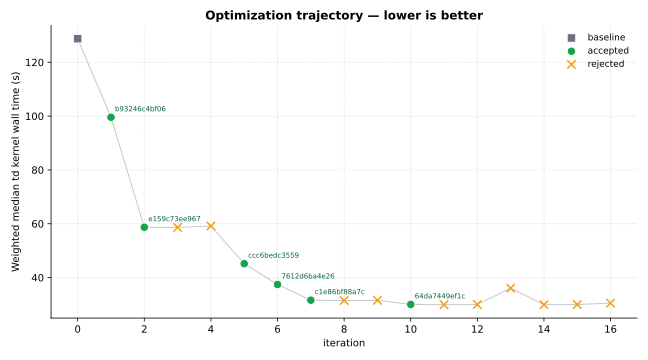
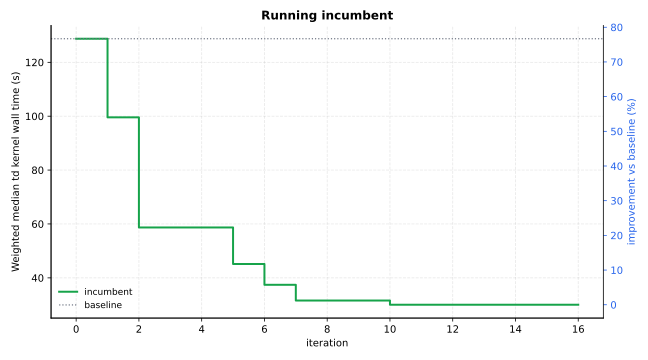

Optimization Report — pyscf-davidson
====================================

.. note::

   The optimized code summarized in this report was generated by the FermiLink AI agent. Review and validate the code changes yourself before using the modified code in scientific or production work. This optimization reporting feature is experimental and is not a final, mature solution.

Primary metric: ``Weighted median td kernel wall time (s)`` (lower is better).

Goal
----


Copied source goal for this optimization: :download:`goal.md <contract/goal.md>`

.. code-block:: markdown

   # Optimization Goal
   
   ## Package
   pyscf
   
   ## Language
   python
   
   ## Target
   Optimize the Davidson-style subspace eigensolver used by PySCF TDDFT/TDA, with primary focus on `pyscf/tdscf/_lr_eig.py` and the TD response call sites in `pyscf/tdscf/rhf.py`, `pyscf/tdscf/rks.py`, `pyscf/tdscf/uhf.py`, and `pyscf/tdscf/uks.py`.
   
   Target optimization opportunities include:
   - more efficient preconditioner strategy for reduced davidson cycles
   - lower-cost projected-subspace construction and update in `eigh`, `eig`, and `real_eig`
   
   Do not treat this as a local Python micro-optimization task. The goal is materially faster TDDFT/TDA eigensolver behavior through better Davidson/subspace algorithm choices.
   
   ## Editable Scope
   - pyscf/tdscf/_lr_eig.py
   - pyscf/tdscf/rhf.py
   - pyscf/tdscf/rks.py
   - pyscf/tdscf/uhf.py
   - pyscf/tdscf/uks.py
   - pyscf/lib/linalg_helper.py
   
   ## Performance Metric
   Minimize end-to-end TDDFT/TDA kernel time.
   
   Primary objective should be weighted median total wall-clock time across all benchmark cases. Secondary objective should be lower Davidson iteration count or fewer matrix-vector applications when the benchmark runner can expose those metrics.
   
   ## Correctness Constraints
   - Excitation energies absolute delta <= 5e-6 Hartree vs incumbent baseline for every reported root
   - Oscillator strengths absolute delta <= 1e-4 for singlet closed-shell cases where the benchmark exposes them
   - Exact match of the values of transition dipole moments is not required as gauge change may flip the sign of transition dipoles
   - All requested roots must converge, and root ordering should remain consistent with the incumbent baseline
   - Do not loosen SCF `conv_tol`, TD solver `conv_tol`, `lindep`, `max_cycle`, `positive_eig_threshold`, `deg_eia_thresh`, `nstates`, or symmetry filtering
   - Do not replace TDDFT with TDA/Casida, reduce the number of roots, change functionals/basis sets, or alter DFT grid settings to gain speed
   - No case-specific shortcuts keyed on molecule identity, spin state, functional family, or whether the case is train vs test
   
   ## Representative Workloads
   - train-rks-bp86-casida-benzene: benzene geometry from `examples/2-benchmark/bz.py` but with smaller basis / 6-31g / RKS / `xc='b88,p86'` / `CasidaTDDFT` / singlet / `nstates=12`
   - train-rks-b3lyp-tddft-benzene: benzene geometry from `examples/2-benchmark/bz.py` but with smaller basis / 6-31g / RKS / `xc='b3lyp5'` / `TDDFT` / singlet / `nstates=10`
   - train-uks-bp86-casida-allyl: allyl radical geometry from `examples/mp/12-dfump2-natorbs.py` but with smaller basis / def2-svp / spin=1 / UKS / `xc='b88,p86'` / `CasidaTDDFT` / `nstates=8`
   - test-rks-bp86-casida-benzene-631gss: benzene geometry from `examples/2-benchmark/bz.py` / 6-31g** / RKS / `xc='b88,p86'` / `CasidaTDDFT` / singlet / `nstates=12`
   - test-rks-b3lyp-tddft-benzene-631gss: benzene geometry from `examples/2-benchmark/bz.py` / 6-31g** / RKS / `xc='b3lyp5'` / `TDDFT` / singlet / `nstates=10`
   - test-uks-bp86-casida-allyl-def2tzvp: allyl radical geometry from `examples/mp/12-dfump2-natorbs.py` / def2-TZVP / spin=1 / UKS / `xc='b88,p86'` / `CasidaTDDFT` / `nstates=8`
   
   ## Build
   ```bash
   export SOURCE_REPO_ROOT="$(cd "$(git rev-parse --git-common-dir)/.." && pwd)"
   export VENV="/anvil/scratch/x-tli22/fermilink_optimize/project_pyscf/venvs/fermilink-optimize/pyscf-davidson"
   source "$VENV/bin/activate"
   module remove cmake
   cd pyscf/lib
   mkdir -p build
   cd build
   cmake ..
   cmake --build . -j4
   cd ../../../
   python -m pip install -e .
   ```
   
   ## Notes
   - Base the benchmark setups on the larger single-machine geometries already shipped in the local PySCF tree:
     - benzene from `examples/2-benchmark/bz.py`
     - allyl radical from `examples/mp/12-dfump2-natorbs.py`
   - Prefer a smaller number of materially larger cases over many toy test cases, so the benchmark is dominated by Davidson/subspace work rather than Python overhead or SCF startup noise.
   - For DFT cases, mirror the upstream test setup with `dft.radi.ATOM_SPECIFIC_TREUTLER_GRIDS = False` and `mf.grids.prune = None` so the benchmark is dominated by TDDFT/TDA solver behavior instead of grid-noise differences.
   - Keep benchmark behavior deterministic across repeated runs.
   - If the benchmark runner can expose them, record per-case Davidson iteration count, matrix-vector application count, and total TD kernel wall time.
   - Keep all workloads runnable on a single workstation-class machine with BLAS thread counts pinned to 1; prefer increasing molecular size or `nstates` only until TD kernel time clearly dominates SCF time.
   - In the generated benchmark YAML, include a top-level split block:
     ```yaml
     split:
       train_case_ids:
         - train-rks-bp86-casida-benzene
         - train-rks-b3lyp-tddft-benzene
         - train-uks-bp86-casida-allyl
     ```

Summary
-------


- baseline (`44c83aaae41f <summary-baseline-44c83aaae41f_>`_): ``128.753``
- best accepted (`64da7449ef1c <summary-best-64da7449ef1c_>`_): ``30.0181`` (+76.69% vs baseline)
- published GitHub branch: `fermilink-optimize/pyscf-davidson <https://github.com/skilled-scipkg/pyscf/tree/fermilink-optimize%2Fpyscf-davidson>`_
- iterations: 17 total | 6 accepted | 10 rejected | 0 correctness failure

Optimization Trajectory
-----------------------






All iterations
--------------


+------+-------------------------------------------------+----------+---------+--------------------------------------------------------------------------------------------------------+
| iter | commit                                          | status   | metric  | summary                                                                                                |
+======+=================================================+==========+=========+========================================================================================================+
| 0    | `44c83aaae41f <iter-0000-table-44c83aaae41f_>`_ | baseline | 128.753 | baseline                                                                                               |
+------+-------------------------------------------------+----------+---------+--------------------------------------------------------------------------------------------------------+
| 1    | `b93246c4bf06 <iter-0001-table-b93246c4bf06_>`_ | accepted | 99.5699 | Use root-specific Ritz values for LR Davidson residual preconditioning, including vectorized shif…     |
+------+-------------------------------------------------+----------+---------+--------------------------------------------------------------------------------------------------------+
| 2    | `e159c73ee967 <iter-0002-table-e159c73ee967_>`_ | accepted | 58.7037 | Limit real TDDFT Davidson expansion in \`_lr_eig.real_eig\` to requested roots to avoid non-target …   |
+------+-------------------------------------------------+----------+---------+--------------------------------------------------------------------------------------------------------+
| 3    | 7b1eeb5571f7                                    | rejected | 58.6193 | Limit symmetric \`_lr_eig.eigh\` Davidson trial-vector expansion to requested roots while keeping r…   |
+------+-------------------------------------------------+----------+---------+--------------------------------------------------------------------------------------------------------+
| 4    | f46de8e0dbb1                                    | rejected | 59.1828 | Cap symmetric LR Davidson expansion to requested roots and add a 1e-3 default TD preconditioner l…     |
+------+-------------------------------------------------+----------+---------+--------------------------------------------------------------------------------------------------------+
| 5    | `ccc6bedc3559 <iter-0005-table-ccc6bedc3559_>`_ | accepted | 45.1467 | Correct real TDDFT Davidson preconditioning to pass the full lower LR residual block by using \`-R…    |
+------+-------------------------------------------------+----------+---------+--------------------------------------------------------------------------------------------------------+
| 6    | `7612d6ba4e26 <iter-0006-table-7612d6ba4e26_>`_ | accepted | 37.4126 | Cap symmetric \`_lr_eig.eigh\` Davidson expansion to requested roots to avoid non-target Casida res…   |
+------+-------------------------------------------------+----------+---------+--------------------------------------------------------------------------------------------------------+
| 7    | `c1e86bf88a7c <iter-0007-table-c1e86bf88a7c_>`_ | accepted | 31.5845 | Limit symmetric \`_lr_eig.eigh\` residual and preconditioner candidate generation to requested targ…   |
+------+-------------------------------------------------+----------+---------+--------------------------------------------------------------------------------------------------------+
| 8    | 3c057cbab323                                    | rejected | 31.47   | Pass occupied-only MO coefficient/occupation arrays into DFT TD response kernel cache setup for r…     |
+------+-------------------------------------------------+----------+---------+--------------------------------------------------------------------------------------------------------+
| 9    | caffdfe9f92b                                    | rejected | 31.5343 | Add a configurable 0.02 Hartree spectral shift to \`_lr_eig.real_eig\` correction preconditioning t…   |
+------+-------------------------------------------------+----------+---------+--------------------------------------------------------------------------------------------------------+
| 10   | `64da7449ef1c <iter-0010-table-64da7449ef1c_>`_ | accepted | 30.0181 | Add a 0.05 Hartree real_eig correction preconditioner spectral shift to reduce late-cycle B3LYP T…     |
+------+-------------------------------------------------+----------+---------+--------------------------------------------------------------------------------------------------------+
| 11   | 110904bf4af3                                    | rejected | 29.8953 | Reduce DFT TD response setup/allocation overhead by using occupied-only response cache inputs and…     |
+------+-------------------------------------------------+----------+---------+--------------------------------------------------------------------------------------------------------+
| 12   | 701a4b52c9e7                                    | rejected | 29.9925 | Stable-sort threshold-selected RHF/UHF Koopmans TD initial guesses by increasing diagonal gap bef…     |
+------+-------------------------------------------------+----------+---------+--------------------------------------------------------------------------------------------------------+
| 13   | c2b4290991d4                                    | rejected | 36.0526 | Add configurable LR correction preconditioner shifts in \`_lr_eig.py\`: a small \`+1e-3\` shift for s… |
+------+-------------------------------------------------+----------+---------+--------------------------------------------------------------------------------------------------------+
| 14   | 933fdb1739c3                                    | rejected | 29.9178 | Reduce DFT TD response setup/allocation overhead by using occupied-only response-cache inputs, fu…     |
+------+-------------------------------------------------+----------+---------+--------------------------------------------------------------------------------------------------------+
| 15   | c046c9ec1362                                    | rejected | 29.968  | Vectorize symmetric \`_lr_eig.eigh\` correction preconditioning for unconverged target residuals in…   |
+------+-------------------------------------------------+----------+---------+--------------------------------------------------------------------------------------------------------+
| 16   | 2a188b646cff                                    | rejected | 30.5035 | Taper the accepted real_eig correction preconditioner shift downward for late-stage residuals bel…     |
+------+-------------------------------------------------+----------+---------+--------------------------------------------------------------------------------------------------------+

Accepted Commits
----------------


Accepted candidate detail pages and current manual-review status:

+-----------------------------------------------------+----------------------------------------+
| accepted commit                                     | Human verification                     |
+=====================================================+========================================+
| :doc:`b93246c4bf06 <iterations/iter_0001_accepted>` | not verified                           |
+-----------------------------------------------------+----------------------------------------+
| :doc:`e159c73ee967 <iterations/iter_0002_accepted>` | not verified                           |
+-----------------------------------------------------+----------------------------------------+
| :doc:`ccc6bedc3559 <iterations/iter_0005_accepted>` | not verified                           |
+-----------------------------------------------------+----------------------------------------+
| :doc:`7612d6ba4e26 <iterations/iter_0006_accepted>` | not verified                           |
+-----------------------------------------------------+----------------------------------------+
| :doc:`c1e86bf88a7c <iterations/iter_0007_accepted>` | not verified                           |
+-----------------------------------------------------+----------------------------------------+
| :doc:`64da7449ef1c <iterations/iter_0010_accepted>` | not verified                           |
+-----------------------------------------------------+----------------------------------------+

.. toctree::
   :maxdepth: 1
   :hidden:

   iterations/iter_0001_accepted
   iterations/iter_0002_accepted
   iterations/iter_0005_accepted
   iterations/iter_0006_accepted
   iterations/iter_0007_accepted
   iterations/iter_0010_accepted

Benchmark Contracts
-------------------


Necessary files to reproduce the FermiLink optimization results:

- :download:`benchmark.yaml <contract/benchmark.yaml>`
- :download:`benchmark_runner.py <contract/benchmark_runner.py>`
- :download:`goal.md <contract/goal.md>`

Runtime Data
------------


FermiLink runtime data for accepted/rejected commits.

- :download:`results.tsv <data/results.tsv>`
- :download:`summary.json <data/summary.json>`

Rerun Guide
-----------


Agent provider ``codex``; model ``gpt-5.4-xhigh``

Use the bundled contract files from this report to recreate the optimization against a fresh upstream checkout.

- default upstream clone: ``git@github.com:skilled-scipkg/pyscf.git``
- confirm the upstream default branch before creating the worktree: `master on GitHub <https://github.com/skilled-scipkg/pyscf/tree/master>`_
- detected package language: ``python``; use ``fermilink-optimize-python`` for goal-mode reruns
- if :download:`goal_inputs.json <contract/goal_inputs.json>` is present, restage the listed auxiliary workload files before rerunning

.. code-block:: bash

   git clone git@github.com:skilled-scipkg/pyscf.git
   cd pyscf
   git worktree add -b fermilink-optimize/pyscf-<modified-feature> ../pyscf-<modified-feature> master

Path 1: Rerun from goal.md
~~~~~~~~~~~~~~~~~~~~~~~~~~

Rerun from the bundled :download:`goal.md <contract/goal.md>`.

.. note::

   Tune the copied ``## Build`` section in :download:`goal.md <contract/goal.md>` before rerunning. Update environment activation, module loads, compiler paths, install prefixes, and other machine-specific setup so FermiLink builds the package correctly.

   .. code-block:: bash

      export SOURCE_REPO_ROOT="$(cd "$(git rev-parse --git-common-dir)/.." && pwd)"
      export VENV="/anvil/scratch/x-tli22/fermilink_optimize/project_pyscf/venvs/fermilink-optimize/pyscf-davidson"
      source "$VENV/bin/activate"
      module remove cmake
      cd pyscf/lib
      mkdir -p build
      cd build
      cmake ..
      cmake --build . -j4
      cd ../../../
      python -m pip install -e .

Run this from the cloned main repo so the launcher can create or reuse the sibling worktree:

.. code-block:: bash

   fermilink-optimize-python \
     --project-root "$PWD" \
     --goal /path/to/report/contract/goal.md \
     --branch fermilink-optimize/pyscf-<modified-feature> \
     --worktree-root .. \
     --worktree-name pyscf-<modified-feature>

Path 2: More deterministic rerun from benchmark.yaml
~~~~~~~~~~~~~~~~~~~~~~~~~~~~~~~~~~~~~~~~~~~~~~~~~~~~

Rerun from the copied :download:`benchmark.yaml <contract/benchmark.yaml>` and :download:`benchmark_runner.py <contract/benchmark_runner.py>`. These files are generated from ``goal.md`` by FermiLink, serving as a deterministic benchmark contract that the agent needs to follow during optimization iterations. FermiLink does not directly rely on ``goal.md`` for optimization iterations.

This avoids regenerating the benchmark contract from ``goal.md`` before the campaign starts:

.. note::

   Inspect :download:`benchmark.yaml <contract/benchmark.yaml>` before rerunning. Update ``runtime.pre_commands`` for machine-specific build/setup steps, and verify that ``runtime.command`` paths point at files that exist in the new worktree.

.. code-block:: bash

   cd ../pyscf-<modified-feature>
   mkdir -p .fermilink-optimize/autogen
   cp /path/to/report/contract/benchmark.yaml .fermilink-optimize/autogen/benchmark.yaml
   cp /path/to/report/contract/benchmark_runner.py .fermilink-optimize/autogen/benchmark_runner.py
   printf '%s\n' '.fermilink-optimize/' >> .git/info/exclude
   fermilink optimize pyscf "$PWD" \
     --benchmark "$PWD/.fermilink-optimize/autogen/benchmark.yaml" \
     --skills-source existing

Benchmark Examples
------------------

Worker iterations run the ``train-*`` benchmark cases below while searching for candidate changes:

.. code-block:: yaml

   cases:
   - id: train-rks-bp86-casida-benzene
     weight: 1.0
     geometry_name: benzene
     geometry_source: examples/2-benchmark/bz.py
     basis: 6-31g
     charge: 0
     spin: 0
     symmetry: false
     scf_method: RKS
     xc: b88,p86
     td_method: CasidaTDDFT
     nstates: 12
     singlet: true
     frozen: null
     wfnsym: null
     scf_conv_tol: 1.0e-10
     td_conv_tol: 1.0e-05
     lindep: 1.0e-12
     max_cycle: 100
     positive_eig_threshold: 0.001
     deg_eia_thresh: 0.001
     max_memory: 4000
     oscillator_strength: true
   - id: train-rks-b3lyp-tddft-benzene
     weight: 1.0
     geometry_name: benzene
     geometry_source: examples/2-benchmark/bz.py
     basis: 6-31g
     charge: 0
     spin: 0
     symmetry: false
     scf_method: RKS
     xc: b3lyp5
     td_method: TDDFT
     nstates: 10
     singlet: true
     frozen: null
     wfnsym: null
     scf_conv_tol: 1.0e-10
     td_conv_tol: 1.0e-05
     lindep: 1.0e-12
     max_cycle: 100
     positive_eig_threshold: 0.001
     deg_eia_thresh: 0.001
     max_memory: 4000
     oscillator_strength: true
   - id: train-uks-bp86-casida-allyl
     weight: 1.0
     geometry_name: allyl
     geometry_source: examples/mp/12-dfump2-natorbs.py
     basis: def2-svp
     charge: 0
     spin: 1
     symmetry: false
     scf_method: UKS
     xc: b88,p86
     td_method: CasidaTDDFT
     nstates: 8
     singlet: null
     frozen: null
     wfnsym: null
     scf_conv_tol: 1.0e-10
     td_conv_tol: 1.0e-05
     lindep: 1.0e-12
     max_cycle: 100
     positive_eig_threshold: 0.001
     deg_eia_thresh: 0.001
     max_memory: 4000
     oscillator_strength: false

Controller reviews run the ``test-*`` benchmark cases below to validate accepted candidates:

.. code-block:: yaml

   cases:
   - id: test-rks-bp86-casida-benzene-631gss
     weight: 1.0
     geometry_name: benzene
     geometry_source: examples/2-benchmark/bz.py
     basis: 6-31g**
     charge: 0
     spin: 0
     symmetry: false
     scf_method: RKS
     xc: b88,p86
     td_method: CasidaTDDFT
     nstates: 12
     singlet: true
     frozen: null
     wfnsym: null
     scf_conv_tol: 1.0e-10
     td_conv_tol: 1.0e-05
     lindep: 1.0e-12
     max_cycle: 100
     positive_eig_threshold: 0.001
     deg_eia_thresh: 0.001
     max_memory: 4000
     oscillator_strength: true
   - id: test-rks-b3lyp-tddft-benzene-631gss
     weight: 1.0
     geometry_name: benzene
     geometry_source: examples/2-benchmark/bz.py
     basis: 6-31g**
     charge: 0
     spin: 0
     symmetry: false
     scf_method: RKS
     xc: b3lyp5
     td_method: TDDFT
     nstates: 10
     singlet: true
     frozen: null
     wfnsym: null
     scf_conv_tol: 1.0e-10
     td_conv_tol: 1.0e-05
     lindep: 1.0e-12
     max_cycle: 100
     positive_eig_threshold: 0.001
     deg_eia_thresh: 0.001
     max_memory: 4000
     oscillator_strength: true
   - id: test-uks-bp86-casida-allyl-def2tzvp
     weight: 1.0
     geometry_name: allyl
     geometry_source: examples/mp/12-dfump2-natorbs.py
     basis: def2-TZVP
     charge: 0
     spin: 1
     symmetry: false
     scf_method: UKS
     xc: b88,p86
     td_method: CasidaTDDFT
     nstates: 8
     singlet: null
     frozen: null
     wfnsym: null
     scf_conv_tol: 1.0e-10
     td_conv_tol: 1.0e-05
     lindep: 1.0e-12
     max_cycle: 100
     positive_eig_threshold: 0.001
     deg_eia_thresh: 0.001
     max_memory: 4000
     oscillator_strength: false


.. _summary-baseline-44c83aaae41f: https://github.com/skilled-scipkg/pyscf/commit/44c83aaae41f
.. _summary-best-64da7449ef1c: https://github.com/skilled-scipkg/pyscf/commit/64da7449ef1c
.. _iter-0000-table-44c83aaae41f: https://github.com/skilled-scipkg/pyscf/commit/44c83aaae41f
.. _iter-0001-table-b93246c4bf06: https://github.com/skilled-scipkg/pyscf/commit/b93246c4bf06
.. _iter-0002-table-e159c73ee967: https://github.com/skilled-scipkg/pyscf/commit/e159c73ee967
.. _iter-0005-table-ccc6bedc3559: https://github.com/skilled-scipkg/pyscf/commit/ccc6bedc3559
.. _iter-0006-table-7612d6ba4e26: https://github.com/skilled-scipkg/pyscf/commit/7612d6ba4e26
.. _iter-0007-table-c1e86bf88a7c: https://github.com/skilled-scipkg/pyscf/commit/c1e86bf88a7c
.. _iter-0010-table-64da7449ef1c: https://github.com/skilled-scipkg/pyscf/commit/64da7449ef1c
