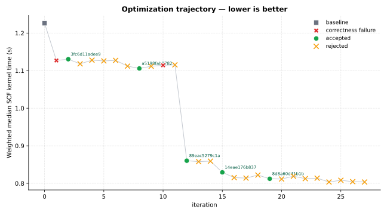
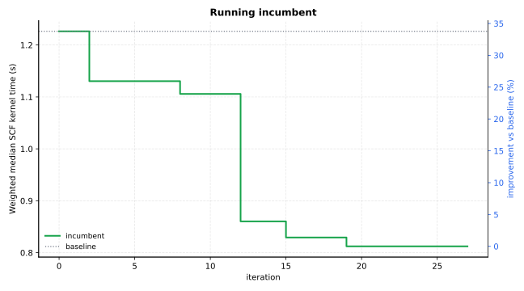

Optimization Report — pyscf-diis_scf
====================================

.. note::

   The optimized code summarized in this report was generated by the FermiLink AI agent. Review and validate the code changes yourself before using the modified code in scientific or production work. This optimization reporting feature is experimental and is not a final, mature solution.

Primary metric: ``Weighted median SCF kernel time (s)`` (lower is better).

Goal
----


Copied source goal for this optimization: :download:`goal.md <contract/goal.md>`

.. code-block:: markdown

   # Optimization Goal
   
   ## Package
   pyscf
   
   ## Language
   python
   
   ## Target
   Optimize the molecular Kohn-Sham DFT SCF loop in PySCF, with primary focus on
   DIIS-family acceleration and early-cycle stabilization in the conventional
   `mf.kernel()` path.
   
   Focus on the shared molecular RKS / UKS hot path:
   - `pyscf/scf/hf.py` -- generic SCF kernel, DIIS setup, Fock update call sites, and convergence checks
   - `pyscf/scf/diis.py` -- CDIIS / ADIIS / EDIIS logic, error-vector construction, and switching behavior
   - `pyscf/lib/diis.py` -- DIIS subspace storage, conditioning, extrapolation, and rollback behavior
   - `pyscf/dft/rks.py`, `pyscf/dft/uks.py` -- DFT effective-potential path and class wiring
   - `pyscf/scf/uhf.py` only when a change is required by the same shared DIIS / SCF machinery
   
   In scope:
   - more reliable DIIS subspace rejection or rollback when the extrapolation problem is ill-conditioned
   - better CDIIS / ADIIS / EDIIS handoff in early or oscillatory cycles
   - adaptive use of already-supported damping / level-shift controls without changing their public semantics
   - reductions in SCF cycle count or DIIS-phase cost on hard but incumbent-converged molecular DFT cases
   
   Out of scope:
   - switching workloads to Newton / SOSCF
   - loosening `conv_tol` / `conv_tol_grad` or increasing `max_cycle`
   - changing molecule, basis, XC functional, grid level, charge, spin, occupations, symmetry, or initial guess
   - speedups from unrelated code outside the SCF / DIIS path
   
   ## Editable Scope
   - pyscf/lib/diis.py
   - pyscf/scf/diis.py
   - pyscf/scf/hf.py
   - pyscf/scf/uhf.py
   - pyscf/dft/rks.py
   - pyscf/dft/uks.py
   
   ## Performance Metric
   Minimize `weighted_median_scf_kernel_seconds`, defined as the weighted median of
   per-case end-to-end `mf.kernel()` wall-clock time across all representative
   workloads under pinned single-thread execution.
   
   Secondary objectives:
   - lower `scf_cycles`
   - lower `diis_update_seconds`, `get_fock_seconds`, and `eig_seconds` when the runner can expose them
   - no loss of convergence on any representative case
   
   ## Correctness Constraints
   - All representative workloads must converge in the incumbent baseline and in accepted candidates under the stated `conv_tol`, `conv_tol_grad`, and `max_cycle` settings.
   - Total SCF energy absolute delta <= `5e-8` Hartree for RKS cases and <= `1e-7` Hartree for UKS cases versus the incumbent baseline.
   - Final orbital-gradient norm must remain <= the workload `conv_tol_grad` threshold when the runner exposes it.
   - Molecular-orbital energies RMS delta for occupied orbitals and the lowest 10 virtual orbitals <= `2e-5` Hartree when the runner exposes comparable orbitals.
   - Density-matrix RMS delta <= `2e-6` versus the incumbent baseline when the runner exposes density matrices.
   - Preserve user-facing semantics for `mf.diis`, `mf.DIIS`, `diis_space`, `diis_start_cycle`, `diis_space_rollback`, `diis_damp`, `damp`, `level_shift`, `conv_tol`, `conv_tol_grad`, and `max_cycle`.
   - Do not disable DIIS, silently enable Newton / SOSCF / smearing / fractional occupations, reduce DFT grid quality, or increase thread count to gain speed.
   - Easy regression cases must remain converged with no more than 1 additional SCF cycle versus the incumbent baseline.
   - No case-specific shortcuts keyed on molecule identity, charge, spin, basis, XC functional, or whether a case is `train-` or `test-`.
   
   ## Representative Workloads
   ## Representative Workloads
   - train-rks-h4-square: H4 square, side length 1.70 Angstrom, charge=0, spin=0, RKS, `xc='pbe0'`, `basis='cc-pVDZ'`, `init_guess='minao'`, `grids.level=3`, `conv_tol=1e-9`, `max_cycle=80`, `diis_space=8`, no smearing.
   - train-rks-stretched-n2: N2 at bond length 2.40 Angstrom, charge=0, spin=0, RKS, `xc='b3lyp'`, `basis='def2-SVP'`, `init_guess='minao'`, `grids.level=3`, `conv_tol=1e-9`, `max_cycle=80`, `diis_space=8`, no smearing.
   - test-uks-no2-radical: bent NO2 radical, N-O=1.20 Angstrom, O-N-O angle=134 degrees, charge=0, spin=1, UKS, `xc='b3lyp'`, `basis='6-31g*'`, `init_guess='minao'`, `grids.level=3`, `conv_tol=1e-9`, `max_cycle=80`, `diis_space=8`.
   - test-uks-feo: linear FeO, Fe-O=1.62 Angstrom, charge=0, spin=4, UKS, `xc='pbe0'`, `basis='def2-SVP'`, `init_guess='atom'`, `grids.level=3`, `conv_tol=1e-8`, `max_cycle=100`, `diis_space=10`.
   - test-rks-benzene-anion-diffuse: benzene radical anion, standard planar D6h geometry, charge=-1, spin=1, UKS, `xc='b3lyp'`, `basis='6-31+g*'`, `init_guess='minao'`, `grids.level=3`, `conv_tol=1e-9`, `max_cycle=100`, `diis_space=10`.
   - test-rks-h6-ring: H6 regular hexagon, side length 1.45 Angstrom, charge=0, spin=0, RKS, `xc='pbe0'`, `basis='cc-pVDZ'`, `init_guess='minao'`, `grids.level=3`, `conv_tol=1e-9`, `max_cycle=80`, `diis_space=8`.
   - test-rks-stretched-co: CO at bond length 2.30 Angstrom, charge=0, spin=0, RKS, `xc='b3lyp'`, `basis='def2-SVP'`, `init_guess='minao'`, `grids.level=3`, `conv_tol=1e-9`, `max_cycle=80`, `diis_space=8`.
   - test-uks-o2-dimer: two O2 fragments separated by 3.20 Angstrom, each O-O=1.21 Angstrom, total charge=0, spin=4, UKS, `xc='pbe'`, `basis='def2-SVP'`, `init_guess='atom'`, `grids.level=3`, `conv_tol=1e-8`, `max_cycle=100`, `diis_space=10`.
   
   ## Build
   ```bash
   export SOURCE_REPO_ROOT="$(cd "$(git rev-parse --git-common-dir)/.." && pwd)"
   export VENV="/anvil/scratch/x-tli22/fermilink_optimize/project_pyscf/venvs/fermilink-optimize/pyscf-diis_scf"
   source "$VENV/bin/activate"
   module remove cmake
   cd pyscf/lib
   mkdir -p build
   cd build
   cmake ..
   cmake --build . -j4
   cd ../../../
   python -m pip install -e .
   ```
   
   ## Notes
   - Keep benchmark behavior deterministic with `OMP_NUM_THREADS=1`, `MKL_NUM_THREADS=1`, `OPENBLAS_NUM_THREADS=1`, and `NUMEXPR_NUM_THREADS=1`.
   - Run the `## Build` commands from the PySCF repo root inside the campaign's active Python environment.
   - Preserve the `train-` / `test-` case ids directly in generated benchmark cases and let FermiLink infer the split from the prefixes.
   - Treat the cases above as hard but incumbent-converged workloads. Do not intentionally include baseline-nonconverged cases in the initial benchmark suite; baseline correctness must pass before the optimize campaign can start.
   - If the runner can expose them, record per-case `scf_kernel_seconds`, `scf_cycles`, `diis_update_seconds`, `get_fock_seconds`, `eig_seconds`, `converged`, `e_tot`, `norm_gorb`, and density-matrix change norm.
   - Assume the campaign is launched with `bin/fermilink-optimize-python` or an already activated environment. Do not hard-code a site-specific absolute venv path in generated runtime commands.
   - If a case proves too fragile to pass preflight reproducibly, replace it with a nearby molecule/system of similar AO size and SCF difficulty rather than weakening the correctness gates.

Summary
-------


- baseline (`44c83aaae41f <summary-baseline-44c83aaae41f_>`_): ``1.22637``
- best accepted (`8d8a60d41b1b <summary-best-8d8a60d41b1b_>`_): ``0.812246`` (+33.77% vs baseline)
- published GitHub branch: `fermilink-optimize/pyscf-diis_scf <https://github.com/skilled-scipkg/pyscf/tree/fermilink-optimize%2Fpyscf-diis_scf>`_
- iterations: 28 total | 5 accepted | 20 rejected | 2 correctness failure

Optimization Trajectory
-----------------------






All iterations
--------------


+------+-------------------------------------------------+---------------------+----------+------------------------------------------------------------------------------------------------------+
| iter | commit                                          | status              | metric   | summary                                                                                              |
+======+=================================================+=====================+==========+======================================================================================================+
| 0    | `44c83aaae41f <iter-0000-table-44c83aaae41f_>`_ | baseline            | 1.22637  | baseline                                                                                             |
+------+-------------------------------------------------+---------------------+----------+------------------------------------------------------------------------------------------------------+
| 1    | 61af054e3309                                    | correctness_failure | 1.12702  | Skip redundant unshifted SCF extra-cycle potential rebuild after canonical density is already bel…   |
+------+-------------------------------------------------+---------------------+----------+------------------------------------------------------------------------------------------------------+
| 2    | `3fc6d11adee9 <iter-0002-table-3fc6d11adee9_>`_ | accepted            | 1.13042  | Guard final SCF extra-cycle get_veff rebuild with small canonical-density and gradient thresholds…   |
+------+-------------------------------------------------+---------------------+----------+------------------------------------------------------------------------------------------------------+
| 3    | fe174d17db12                                    | rejected            | 1.11806  | Use AO-basis CDIIS error vectors for restricted SCF runs with a near-zero initial HOMO-LUMO gap, …   |
+------+-------------------------------------------------+---------------------+----------+------------------------------------------------------------------------------------------------------+
| 4    | cc9080893ef4                                    | rejected            | 1.12786  | Lazy DIIS Corth initialization in hf.py, retaining AO-basis CDIIS for restricted near-zero first …   |
+------+-------------------------------------------------+---------------------+----------+------------------------------------------------------------------------------------------------------+
| 5    | d5d6fd79c2d9                                    | rejected            | 1.12583  | Extend the guarded final SCF extra-cycle potential reuse with an energy-stability fallback for mo…   |
+------+-------------------------------------------------+---------------------+----------+------------------------------------------------------------------------------------------------------+
| 6    | 4115f7500839                                    | rejected            | 1.12727  | Reuse the DIIS setup eigensolution for the first standard SCF cycle and use direct plain-Fock con…   |
+------+-------------------------------------------------+---------------------+----------+------------------------------------------------------------------------------------------------------+
| 7    | 823bbe5bec61                                    | rejected            | 1.11199  | Defer per-cycle dump_chk writes for the automatically created temporary chkfile when no callback …   |
+------+-------------------------------------------------+---------------------+----------+------------------------------------------------------------------------------------------------------+
| 8    | `a5198fab0782 <iter-0008-table-a5198fab0782_>`_ | accepted            | 1.1058   | Combine AO-basis CDIIS error vectors for restricted near-zero initial HOMO-LUMO gaps with deferre…   |
+------+-------------------------------------------------+---------------------+----------+------------------------------------------------------------------------------------------------------+
| 9    | cee4ed30a38d                                    | rejected            | 1.11158  | Guard final SCF extra diagonalization with a small last-density-step check, preserving the existi…   |
+------+-------------------------------------------------+---------------------+----------+------------------------------------------------------------------------------------------------------+
| 10   | 15371b3f64b0                                    | correctness_failure | 1.11423  | Guarded early final-convergence certification in \`hf.kernel\`, saving a near-converged follow-up S… |
+------+-------------------------------------------------+---------------------+----------+------------------------------------------------------------------------------------------------------+
| 11   | 9ceb1992d98c                                    | rejected            | 1.11542  | Use AO-basis CDIIS error vectors for restricted SCF runs to avoid restricted-only Corth setup eig…   |
+------+-------------------------------------------------+---------------------+----------+------------------------------------------------------------------------------------------------------+
| 12   | `89eac5279c1a <iter-0012-table-89eac5279c1a_>`_ | accepted            | 0.860287 | Cache reusable DFT numerical-integration AO block-loop outputs for unchanged RKS/UKS molecular gr…   |
+------+-------------------------------------------------+---------------------+----------+------------------------------------------------------------------------------------------------------+
| 13   | de439af669fb                                    | rejected            | 0.857868 | Prefer sparse density-matrix rho evaluation for cached RKS/UKS numerical integration by stripping…   |
+------+-------------------------------------------------+---------------------+----------+------------------------------------------------------------------------------------------------------+
| 14   | b24465bd95e3                                    | rejected            | 0.85909  | Use plain ndarray density matrices for UKS numerical-integration calls so cached-AO UKS uses the …   |
+------+-------------------------------------------------+---------------------+----------+------------------------------------------------------------------------------------------------------+
| 15   | `14eae176b837 <iter-0015-table-14eae176b837_>`_ | accepted            | 0.82932  | Build primary molecular RKS/UKS numerical-integration grids without the initial atom-group sortin…   |
+------+-------------------------------------------------+---------------------+----------+------------------------------------------------------------------------------------------------------+
| 16   | 15e0e3d707cc                                    | rejected            | 0.815344 | Fuse alpha and beta tagged-MO density contractions for the common real single-density UKS GGA num…   |
+------+-------------------------------------------------+---------------------+----------+------------------------------------------------------------------------------------------------------+
| 17   | 60729b5492d4                                    | rejected            | 0.814027 | Route cached-AO DFT density evaluation through plain density matrices for RKS after AO cache popu…   |
+------+-------------------------------------------------+---------------------+----------+------------------------------------------------------------------------------------------------------+
| 18   | ae6b140db86a                                    | rejected            | 0.822071 | Route cached-AO DFT density evaluation through plain density matrices, fuse tagged-MO UKS GGA alp…   |
+------+-------------------------------------------------+---------------------+----------+------------------------------------------------------------------------------------------------------+
| 19   | `8d8a60d41b1b <iter-0019-table-8d8a60d41b1b_>`_ | accepted            | 0.812246 | Reduce cached-AO DFT NumInt overhead with per-call molecule shell-metadata reuse, RKS cached-dens…   |
+------+-------------------------------------------------+---------------------+----------+------------------------------------------------------------------------------------------------------+
| 20   | 7c0d081c5cac                                    | rejected            | 0.81156  | Cache immutable ANO basis data used by MINAO initial guesses in hf.py to avoid repeated basis par…   |
+------+-------------------------------------------------+---------------------+----------+------------------------------------------------------------------------------------------------------+
| 21   | 6508de525961                                    | rejected            | 0.819044 | Tighten the default RKS/UKS density-pruning cutoff from 1e-7 to 1e-8, preserving config/user over…   |
+------+-------------------------------------------------+---------------------+----------+------------------------------------------------------------------------------------------------------+
| 22   | 05050f2446e1                                    | rejected            | 0.812563 | Specialize standard GGA deriv=1 XC derivative evaluation inside cached RKS/UKS NumInt calls using…   |
+------+-------------------------------------------------+---------------------+----------+------------------------------------------------------------------------------------------------------+
| 23   | 1b92d9748ab0                                    | rejected            | 0.813801 | Tighten cached UKS GGA fused rho2 dispatch to require a rho2 ratio of at least 5, letting borderl…   |
+------+-------------------------------------------------+---------------------+----------+------------------------------------------------------------------------------------------------------+
| 24   | 3236d2301379                                    | rejected            | 0.803676 | Use spin-summed Coulomb builds in UKS hybrid get_veff while keeping spin-resolved exchange, avoid…   |
+------+-------------------------------------------------+---------------------+----------+------------------------------------------------------------------------------------------------------+
| 25   | e3c52bd40935                                    | rejected            | 0.808245 | Streamline UKS get_veff by avoiding repeated post-initialization spin-density grid sums and using…   |
+------+-------------------------------------------------+---------------------+----------+------------------------------------------------------------------------------------------------------+
| 26   | c0d0df07a312                                    | rejected            | 0.80453  | Skip unobserved automatic temporary chkfile writes and use total-density Coulomb J in standard hy…   |
+------+-------------------------------------------------+---------------------+----------+------------------------------------------------------------------------------------------------------+
| 27   | 64a35b457b66                                    | rejected            | 0.803638 | Avoid copying the cached AO tensor when a stock NumInt block loop produces a single grid block, p…   |
+------+-------------------------------------------------+---------------------+----------+------------------------------------------------------------------------------------------------------+

Accepted Commits
----------------


Accepted candidate detail pages and current manual-review status:

+-----------------------------------------------------+----------------------------------------+
| accepted commit                                     | Human verification                     |
+=====================================================+========================================+
| :doc:`3fc6d11adee9 <iterations/iter_0002_accepted>` | not verified                           |
+-----------------------------------------------------+----------------------------------------+
| :doc:`a5198fab0782 <iterations/iter_0008_accepted>` | not verified                           |
+-----------------------------------------------------+----------------------------------------+
| :doc:`89eac5279c1a <iterations/iter_0012_accepted>` | not verified                           |
+-----------------------------------------------------+----------------------------------------+
| :doc:`14eae176b837 <iterations/iter_0015_accepted>` | not verified                           |
+-----------------------------------------------------+----------------------------------------+
| :doc:`8d8a60d41b1b <iterations/iter_0019_accepted>` | not verified                           |
+-----------------------------------------------------+----------------------------------------+

.. toctree::
   :maxdepth: 1
   :hidden:

   iterations/iter_0002_accepted
   iterations/iter_0008_accepted
   iterations/iter_0012_accepted
   iterations/iter_0015_accepted
   iterations/iter_0019_accepted

Benchmark Contracts
-------------------


Necessary files to reproduce the FermiLink optimization results:

- :download:`benchmark.yaml <contract/benchmark.yaml>`
- :download:`benchmark_runner.py <contract/benchmark_runner.py>`
- :download:`goal.md <contract/goal.md>`

Runtime Data
------------


FermiLink runtime data for accepted/rejected commits.

- :download:`results.tsv <data/results.tsv>`
- :download:`summary.json <data/summary.json>`

Rerun Guide
-----------


Agent provider ``codex``; model ``gpt-5.5-xhigh``

Use the bundled contract files from this report to recreate the optimization against a fresh upstream checkout.

- default upstream clone: ``git@github.com:skilled-scipkg/pyscf.git``
- confirm the upstream default branch before creating the worktree: `master on GitHub <https://github.com/skilled-scipkg/pyscf/tree/master>`_
- detected package language: ``python``; use ``fermilink-optimize-python`` for goal-mode reruns
- if :download:`goal_inputs.json <contract/goal_inputs.json>` is present, restage the listed auxiliary workload files before rerunning

.. code-block:: bash

   git clone git@github.com:skilled-scipkg/pyscf.git
   cd pyscf
   git worktree add -b fermilink-optimize/pyscf-<modified-feature> ../pyscf-<modified-feature> master

Path 1: Rerun from goal.md
~~~~~~~~~~~~~~~~~~~~~~~~~~


Rerun from the bundled :download:`goal.md <contract/goal.md>`.

.. note::

   Tune the copied ``## Build`` section in :download:`goal.md <contract/goal.md>` before rerunning. Update environment activation, module loads, compiler paths, install prefixes, and other machine-specific setup so FermiLink builds the package correctly.

   .. code-block:: bash

      export SOURCE_REPO_ROOT="$(cd "$(git rev-parse --git-common-dir)/.." && pwd)"
      export VENV="/anvil/scratch/x-tli22/fermilink_optimize/project_pyscf/venvs/fermilink-optimize/pyscf-diis_scf"
      source "$VENV/bin/activate"
      module remove cmake
      cd pyscf/lib
      mkdir -p build
      cd build
      cmake ..
      cmake --build . -j4
      cd ../../../
      python -m pip install -e .


Run this from the cloned main repo so the launcher can create or reuse the sibling worktree:

.. code-block:: bash

   fermilink-optimize-python \
     --project-root "$PWD" \
     --goal /path/to/report/contract/goal.md \
     --branch fermilink-optimize/pyscf-<modified-feature> \
     --worktree-root .. \
     --worktree-name pyscf-<modified-feature>

Path 2: More deterministic rerun from benchmark.yaml
~~~~~~~~~~~~~~~~~~~~~~~~~~~~~~~~~~~~~~~~~~~~~~~~~~~~


Rerun from the copied :download:`benchmark.yaml <contract/benchmark.yaml>` and :download:`benchmark_runner.py <contract/benchmark_runner.py>`. These files are generated from ``goal.md`` by FermiLink, serving as a deterministic benchmark contract that the agent needs to follow during optimization iterations. FermiLink does not directly rely on ``goal.md`` for optimization iterations.

This avoids regenerating the benchmark contract from ``goal.md`` before the campaign starts:

.. note::

   Inspect :download:`benchmark.yaml <contract/benchmark.yaml>` before rerunning. Update ``runtime.pre_commands`` for machine-specific build/setup steps, and verify that ``runtime.command`` paths point at files that exist in the new worktree.

.. code-block:: bash

   cd ../pyscf-<modified-feature>
   mkdir -p .fermilink-optimize/autogen
   cp /path/to/report/contract/benchmark.yaml .fermilink-optimize/autogen/benchmark.yaml
   cp /path/to/report/contract/benchmark_runner.py .fermilink-optimize/autogen/benchmark_runner.py
   printf '%s\n' '.fermilink-optimize/' >> .git/info/exclude
   fermilink optimize pyscf "$PWD" \
     --benchmark "$PWD/.fermilink-optimize/autogen/benchmark.yaml" \
     --skills-source existing

Benchmark Examples
------------------


Worker iterations run the ``train-*`` benchmark cases below while searching for candidate changes:

.. code-block:: yaml

   cases:
   - id: train-rks-h4-square
     weight: 1.0
     description: Small closed-shell square H4 RKS hybrid case stressing early-cycle
       stabilization.
     atom: H 0 0 0; H 1.70 0 0; H 0 1.70 0; H 1.70 1.70 0
     unit: Angstrom
     basis: cc-pVDZ
     charge: 0
     spin: 0
     method: RKS
     xc: pbe0
     grids_level: 3
     init_guess: minao
     conv_tol: 1.0e-09
     max_cycle: 80
     diis_space: 8
   - id: train-rks-stretched-n2
     weight: 1.0
     description: Closed-shell stretched N2 RKS B3LYP case with difficult SCF convergence.
     atom: N 0 0 0; N 0 0 2.40
     unit: Angstrom
     basis: def2-SVP
     charge: 0
     spin: 0
     method: RKS
     xc: b3lyp
     grids_level: 3
     init_guess: minao
     conv_tol: 1.0e-09
     max_cycle: 80
     diis_space: 8

Controller reviews run the ``test-*`` benchmark cases below to validate accepted candidates:

.. code-block:: yaml

   cases:
   - id: test-uks-no2-radical
     weight: 1.0
     description: Open-shell bent NO2 radical UKS case covering spin-polarized DFT and
       hybrid-GGA path.
     atom: N 0 0 0; O 1.104605 0 0.468877; O -1.104605 0 0.468877
     unit: Angstrom
     basis: 6-31g*
     charge: 0
     spin: 1
     method: UKS
     xc: b3lyp
     grids_level: 3
     init_guess: minao
     conv_tol: 1.0e-09
     max_cycle: 80
     diis_space: 8
   - id: test-uks-feo
     weight: 1.0
     description: High-spin transition-metal UKS hybrid case for hard oscillatory convergence.
     atom: Fe 0 0 0; O 0 0 1.62
     unit: Angstrom
     basis: def2-SVP
     charge: 0
     spin: 4
     method: UKS
     xc: pbe0
     grids_level: 3
     init_guess: atom
     conv_tol: 1.0e-08
     max_cycle: 100
     diis_space: 10
   - id: test-rks-h6-ring
     weight: 1.0
     description: Closed-shell H6 regular hexagon RKS hybrid case covering near-degenerate
       occupied/virtual structure.
     atom: H 1.45 0 0; H 0.725 1.255737 0; H -0.725 1.255737 0; H -1.45 0 0; H -0.725
       -1.255737 0; H 0.725 -1.255737 0
     unit: Angstrom
     basis: cc-pVDZ
     charge: 0
     spin: 0
     method: RKS
     xc: pbe0
     grids_level: 3
     init_guess: minao
     conv_tol: 1.0e-09
     max_cycle: 80
     diis_space: 8
   - id: test-uks-o2-dimer
     weight: 1.0
     description: High-spin separated O2 dimer UKS pure-GGA case using atom guess and
       larger DIIS space.
     atom: O -0.605 0 -1.60; O 0.605 0 -1.60; O -0.605 0 1.60; O 0.605 0 1.60
     unit: Angstrom
     basis: def2-SVP
     charge: 0
     spin: 4
     method: UKS
     xc: pbe
     grids_level: 3
     init_guess: atom
     conv_tol: 1.0e-08
     max_cycle: 100
     diis_space: 10


.. _summary-baseline-44c83aaae41f: https://github.com/skilled-scipkg/pyscf/commit/44c83aaae41f
.. _summary-best-8d8a60d41b1b: https://github.com/skilled-scipkg/pyscf/commit/8d8a60d41b1b
.. _iter-0000-table-44c83aaae41f: https://github.com/skilled-scipkg/pyscf/commit/44c83aaae41f
.. _iter-0002-table-3fc6d11adee9: https://github.com/skilled-scipkg/pyscf/commit/3fc6d11adee9
.. _iter-0008-table-a5198fab0782: https://github.com/skilled-scipkg/pyscf/commit/a5198fab0782
.. _iter-0012-table-89eac5279c1a: https://github.com/skilled-scipkg/pyscf/commit/89eac5279c1a
.. _iter-0015-table-14eae176b837: https://github.com/skilled-scipkg/pyscf/commit/14eae176b837
.. _iter-0019-table-8d8a60d41b1b: https://github.com/skilled-scipkg/pyscf/commit/8d8a60d41b1b
